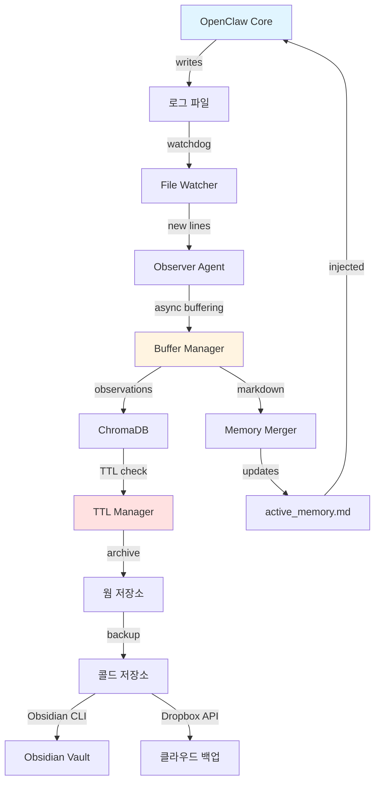

# OC-Memory 기술 명세서 (Technical Specification)
## OpenClaw를 위한 관찰 메모리 시스템 (Observational Memory System)

**버전**: 2.0
**날짜**: 2026-02-12
**작성자**: Argo (OpenClaw General Manager)
**상태**: Implementation Ready

---

## 목차 (Table of Contents)

1. [시스템 아키텍처](#1-시스템-아키텍처)
2. [기술 설계](#2-기술-설계)
3. [API 명세](#3-api-명세)
4. [통합 명세](#4-통합-명세)
5. [데이터 스키마](#5-데이터-스키마)
6. [성능 요구사항](#6-성능-요구사항)
7. [보안 및 프라이버시](#7-보안-및-프라이버시)
8. [배포](#8-배포)
9. [테스트 전략](#9-테스트-전략)
10. [참고자료](#10-참고자료)

---

## 1. 시스템 아키텍처 (System Architecture)

### 1.1 전체 아키텍처 (Overall Architecture)

OC-Memory는 OpenClaw 코어와 독립적으로 작동하는 **사이드카 패턴 (Sidecar Pattern)**을 구현하여 다음을 보장합니다:
- **제로 코드 변경 (Zero-Code-Change)**: OpenClaw 코드베이스 수정 불필요
- **업데이트 안전성 (Update-Safe)**: 향후 OpenClaw 버전과 호환 가능
- **모듈식 설계 (Modular Design)**: 각 컴포넌트를 독립적으로 업그레이드 가능

```
┌─────────────────────────────────────────────────────────────────────────────┐
│                          OpenClaw Core (수정 불필요)                          │
│                                                                              │
│  ┌──────────────┐    ┌──────────────┐    ┌──────────────┐                  │
│  │    Agent     │───▶│   Gateway    │───▶│  Telegram    │                  │
│  │   (Main)     │    │    (API)     │    │   (User)     │                  │
│  └──────────────┘    └──────────────┘    └──────────────┘                  │
│         │                    │                    │                          │
│         │ writes             │ logs               │ interacts                │
│         ▼                    ▼                    ▼                          │
│  ┌─────────────────────────────────────────────────────┐                    │
│  │              OpenClaw 로그 파일                      │                    │
│  │     ~/.openclaw/agents/main/sessions/*.jsonl        │                    │
│  └─────────────────────────────────────────────────────┘                    │
│                              │                                               │
│                              │ reads System Prompt                           │
│                              ▼                                               │
│  ┌─────────────────────────────────────────────────────┐                    │
│  │           active_memory.md (주입됨)                 │                    │
│  └─────────────────────────────────────────────────────┘                    │
└─────────────────────────────────────────────────────────────────────────────┘
                              ▲
                              │ watchdog (파일 시스템 감시)
                              │
┌─────────────────────────────┴───────────────────────────────────────────────┐
│                    OC-Memory Sidecar (외부 프로세스)                         │
│                                                                              │
│  ┌──────────────┐    ┌──────────────┐    ┌──────────────┐                  │
│  │   Watcher    │───▶│   Observer   │───▶│   Merger     │                  │
│  │  (Tail Log)  │    │  (LLM+Async) │    │ (File Writer)│                  │
│  └──────────────┘    └──────────────┘    └──────────────┘                  │
│         │                    │                    │                          │
│         │                    │                    │                          │
│         │                    ▼                    ▼                          │
│         │         ┌──────────────────┐  ┌──────────────────┐                │
│         │         │   ChromaDB       │  │ active_memory.md │                │
│         │         │ (벡터 저장소)     │  │ (핫 메모리)       │                │
│         │         └──────────────────┘  └──────────────────┘                │
│         │                                                                     │
│         ▼                                                                     │
│  ┌──────────────────────────────────────────────────────────────────────┐   │
│  │                         TTL Manager                                   │   │
│  │  - Hot → Warm (90일 자동)                                            │   │
│  │  - Warm → Cold (1년 승인 필요)                                       │   │
│  └──────────────────────────────────────────────────────────────────────┘   │
│                              │                                               │
│                              ▼                                               │
│  ┌──────────────────────────────────────────────────────────────────────┐   │
│  │                      3계층 메모리 저장소                              │   │
│  │  ┌──────────────┐  ┌──────────────┐  ┌──────────────┐               │   │
│  │  │  핫 메모리    │─▶│  웜 메모리    │─▶│  콜드 메모리  │               │   │
│  │  │  ChromaDB    │  │  Markdown    │  │  Obsidian    │               │   │
│  │  │  + MD File   │  │  Archives    │  │  + Dropbox   │               │   │
│  │  │  (90일)      │  │  (1년)       │  │  (영구)       │               │   │
│  │  └──────────────┘  └──────────────┘  └──────────────┘               │   │
│  └──────────────────────────────────────────────────────────────────────┘   │
└──────────────────────────────────────────────────────────────────────────────┘
```

### 1.2 컴포넌트 다이어그램 (Component Diagram)



### 1.3 설정 마법사 컴포넌트 (Setup Wizard Component)

**목적**: 초기 구성 및 설정을 위한 대화형 TUI

설정 마법사는 텍스트 기반 사용자 인터페이스(TUI)를 통해 안내된 설치 경험을 제공하여 수동 구성 파일 편집을 제거하고 설정 오류를 줄입니다.

```
┌─────────────────────────────────────────────────────────────────────────────┐
│                          설정 마법사 플로우                                   │
├─────────────────────────────────────────────────────────────────────────────┤
│                                                                              │
│  단계 1: 기본 구성                                                           │
│  ├── OpenClaw 로그 파일 경로                                                 │
│  ├── 활성 메모리 파일 경로                                                   │
│  └── 로그 모니터링 간격                                                      │
│                                                                              │
│  단계 2: 메모리 계층 구성                                                    │
│  ├── 핫 메모리 TTL (일)                                                      │
│  ├── 핫 메모리 저장소 백엔드 (ChromaDB/File)                                 │
│  ├── 웜 메모리 TTL (일)                                                      │
│  └── 아카이브 저장소 경로                                                    │
│                                                                              │
│  단계 3: LLM 구성                                                            │
│  ├── LLM 제공자 선택 (Gemini/OpenAI/Claude/Custom)                          │
│  ├── API 키 입력 (.env에 600 권한으로 저장)                                  │
│  ├── Observer 모델 구성                                                      │
│  └── Reflector 모델 구성                                                     │
│                                                                              │
│  단계 4: 선택적 기능                                                         │
│  ├── Obsidian 통합 (P2 - 선택사항)                                          │
│  │   ├── Obsidian CLI 감지                                                  │
│  │   ├── Vault 이름 및 경로                                                 │
│  │   └── 콜드 메모리 폴더 구조                                              │
│  └── Dropbox 통합 (P2 - 선택사항)                                           │
│      ├── API 액세스 토큰                                                     │
│      └── 동기화 구성                                                         │
│                                                                              │
│  단계 5: 검토 및 저장                                                        │
│  ├── 구성 요약 표시                                                          │
│  ├── 확인 프롬프트                                                           │
│  └── config.yaml 생성                                                        │
│                                                                              │
│  단계 6: 설치 후 작업                                                        │
│  ├── 다음 단계 표시                                                          │
│  ├── 데몬 시작 지침                                                          │
│  └── OpenClaw 시스템 프롬프트 통합 가이드                                    │
│                                                                              │
└─────────────────────────────────────────────────────────────────────────────┘
```

**기술 스택 (Technology Stack)**:
- **questionary**: 커스텀 스타일링이 적용된 대화형 프롬프트
- **rich**: 향상된 터미널 출력 (선택사항)
- **pyyaml**: YAML 구성 생성

**주요 기능**:
1. **입력 검증 (Input Validation)**: 경로, 간격, 토큰에 대한 실시간 검증
2. **안전한 자격 증명 처리 (Secure Credential Handling)**: API 키를 .env에 600 권한으로 저장 (Unix)
3. **스마트 기본값 (Smart Defaults)**: 표준 OpenClaw 설치 기반 미리 채워진 값
4. **커스텀 스타일링 (Custom Styling)**: questionary 모범 사례에 맞춘 보라색/빨간색 색 구성
5. **오류 복구 (Error Recovery)**: 누락된 종속성 및 취소된 설정의 우아한 처리

### 1.4 데이터 플로우 (Data Flow)

```
┌─────────────────────────────────────────────────────────────────────────────┐
│ 단계 1: 로그 생성                                                            │
├─────────────────────────────────────────────────────────────────────────────┤
│ 1. 사용자가 Telegram을 통해 메시지 전송                                      │
│ 2. OpenClaw Agent가 요청 처리                                               │
│ 3. 대화가 Session Transcript (JSONL)에 기록                                  │
│ 4. 로그 항목에 포함: timestamp, role, content, metadata                     │
└─────────────────────────────────────────────────────────────────────────────┘
                              │
                              ▼
┌─────────────────────────────────────────────────────────────────────────────┐
│ 단계 2: 실시간 모니터링                                                      │
├─────────────────────────────────────────────────────────────────────────────┤
│ 1. File Watcher가 watchdog으로 파일 시스템 모니터링                             │
│ 2. 마지막 위치에서 증분 읽기 (상태 파일에 저장됨)                            │
│ 3. 라인당 토큰 카운팅 (tiktoken cl100k_base 사용)                           │
│ 4. 메모리 버퍼에 누적                                                        │
└─────────────────────────────────────────────────────────────────────────────┘
                              │
                              ▼
┌─────────────────────────────────────────────────────────────────────────────┐
│ 단계 3: 비동기 버퍼링 (새로운 기능 - 2026년 2월)                             │
├─────────────────────────────────────────────────────────────────────────────┤
│ 1. bufferTokens 간격(임계값의 20%)으로 백그라운드 Observer 호출             │
│ 2. 사전 계산된 관찰 청크를 버퍼에 저장                                       │
│ 3. 대화 중 블로킹 없음                                                       │
│ 4. messageTokens 임계값 도달 시 즉시 활성화                                 │
│ 5. 안전장치: blockAfter (120%)가 너무 빠른 경우 동기 관찰 트리거           │
└─────────────────────────────────────────────────────────────────────────────┘
                              │
                              ▼
┌─────────────────────────────────────────────────────────────────────────────┐
│ 단계 4: 관찰 생성                                                            │
├─────────────────────────────────────────────────────────────────────────────┤
│ 1. Observer LLM이 로그 청크 분석                                            │
│ 2. 추출: state, decisions, preferences, tasks                               │
│ 3. 우선순위 분류: 🔴 high / 🟡 medium / 🟢 low                             │
│ 4. 타임스탬프가 포함된 구조화된 출력                                         │
│ 5. 토큰 압축: 5-40배 감소                                                   │
└─────────────────────────────────────────────────────────────────────────────┘
                              │
                              ▼
┌─────────────────────────────────────────────────────────────────────────────┐
│ 단계 5: 이중 저장소                                                          │
├─────────────────────────────────────────────────────────────────────────────┤
│ 경로 A: ChromaDB                      경로 B: Markdown 파일                 │
│ ─────────────────                     ───────────────────                   │
│ 1. 벡터 임베딩                         1. 템플릿 기반 포맷팅                 │
│ 2. 메타데이터 인덱싱                   2. 섹션별 카테고리화                  │
│ 3. 시맨틱 검색 준비                    3. 사람이 읽을 수 있는 형식           │
│ 4. HNSW 인덱스 (코사인)                4. 버전 관리됨                        │
└─────────────────────────────────────────────────────────────────────────────┘
                              │
                              ▼
┌─────────────────────────────────────────────────────────────────────────────┐
│ 단계 6: 메모리 주입                                                          │
├─────────────────────────────────────────────────────────────────────────────┤
│ 1. active_memory.md가 새로운 관찰로 업데이트됨                              │
│ 2. OpenClaw 시스템 프롬프트 지시: "~/.openclaw/active_memory.md 읽기"       │
│ 3. Agent가 각 응답 전에 메모리 로드                                          │
│ 4. 장기 메모리를 가진 컨텍스트 인식 응답                                     │
└─────────────────────────────────────────────────────────────────────────────┘
                              │
                              ▼
┌─────────────────────────────────────────────────────────────────────────────┐
│ 단계 7: 라이프사이클 관리                                                    │
├─────────────────────────────────────────────────────────────────────────────┤
│ 1. TTL Manager가 관찰 수명 확인 (매일 cron)                                 │
│ 2. Hot → Warm: 90일 후 자동 아카이브                                       │
│ 3. Warm → Cold: 1년 후 사용자 승인                                         │
│ 4. 콜드 저장소가 Obsidian + Dropbox에 동기화됨                              │
└─────────────────────────────────────────────────────────────────────────────┘
```

---

## 2. 기술 설계 (Technical Design)

### 2.1 메모리 계층 (Memory Tiers) - Hot/Warm/Cold

#### 2.1.1 계층 1: 핫 메모리 (Hot Memory) - 활성

**목적**: 활성 대화를 위한 실시간 작동 메모리

**저장소 백엔드 (Storage Backends)**:
1. **ChromaDB** (벡터 데이터베이스)
   - 위치: `~/.openclaw/memory_db/`
   - 컬렉션: `observations_hot`
   - 인덱스: HNSW (Hierarchical Navigable Small World)
   - 거리 메트릭: 코사인 유사도
   - 임베딩 모델: 기본값 (all-MiniLM-L6-v2)

2. **Markdown 파일** (사람이 읽을 수 있음)
   - 위치: `~/.openclaw/active_memory.md`
   - 형식: 섹션이 있는 구조화된 마크다운
   - 크기: ~2,500 토큰 (~50,000에서 압축됨)
   - 업데이트: 관찰 생성 시 실시간

**명세 (Specifications)**:
| 속성 | 값 | 근거 |
|----------|-------|-----------|
| 기간 | 90일 | 관련성 vs. 저장소 균형 |
| 최대 크기 | 30 MB | ChromaDB 성능 저하 방지 |
| 최대 토큰 | 30,000 | 대부분의 컨텍스트 창에 맞음 |
| TTL 확인 | 매일 (오전 3시) | 피크 시간대 외 처리 |
| 액세스 패턴 | 읽기 위주 | 인메모리 캐싱으로 최적화 |

**데이터 구조**:
```python
@dataclass
class HotMemoryEntry:
    id: str                    # UUID v4
    timestamp: datetime        # ISO 8601
    priority: str              # high, medium, low
    category: str              # state, decision, preference, task
    content: str               # 관찰 텍스트
    embedding: List[float]     # 384차원 벡터
    metadata: Dict[str, Any]   # 확장 가능한 메타데이터
    ttl_expires: datetime      # 생성 후 90일
```

**ChromaDB 스키마**:
```python
collection = client.create_collection(
    name="observations_hot",
    metadata={
        "hnsw:space": "cosine",
        "hnsw:construction_ef": 200,
        "hnsw:M": 16
    }
)
```

#### 2.1.2 계층 2: 웜 메모리 (Warm Memory) - 아카이브

**목적**: 중기 메모리를 위한 히스토리 참조

**저장소 백엔드**:
- **Markdown 파일** (날짜별 구성)
  - 위치: `~/.openclaw/memory_archive/`
  - 네이밍: `YYYY-MM-DD.md` (일별 아카이브)
  - 인덱스: SQLite FTS5 (전문 검색)
  - 압축: gzip (선택사항, 1MB 이상 파일용)

**명세**:
| 속성 | 값 | 근거 |
|----------|-------|-----------|
| 기간 | 90일 - 1년 | 접근 가능하지만 즉각적이지 않음 |
| 최대 크기 | 85 MB | 히스토리 데이터 누적 |
| 액세스 패턴 | 요청 시 검색 | Grep/SQLite FTS5 검색 |
| 형식 | Markdown | 사람이 읽을 수 있고 git 친화적 |

**파일 구조**:
```markdown
# 메모리 아카이브 - 2026-02-12

## 메타데이터
- 아카이브 출처: 핫 메모리 (계층 1)
- 원본 기간: 2025-11-14 ~ 2026-02-12
- 총 관찰 수: 1,247
- 압축 비율: 15배

## 카테고리별 관찰

### 중요 결정
- 🔴 14:30 사용자가 DeepSeek에서 Z.ai GLM-5로 마이그레이션하기로 결정
- 🔴 15:45 API 키 로테이션 정책 수립 (월별)

### 사용자 선호도
- 🟡 사용자는 ANSI 색상 없는 터미널 출력을 선호함
- 🟡 요청 속도 제한: 메시지 간 0.05-0.1초

### 완료된 작업
- ✅ Z.ai GLM-5 제공자 통합
- ✅ 모델 목록 정리 (6개 모델로 축소)

---
아카이브 일시: 2026-03-12 03:00:00 KST
보존 정책: 아카이브 날짜로부터 1년
```

#### 2.1.3 계층 3: 콜드 메모리 (Cold Memory) - 백업

**목적**: 장기 백업 및 외부 액세스

**저장소 백엔드**:
1. **Obsidian Vault** (Obsidian CLI를 통해)
   - 위치: `~/Documents/Obsidian/Main/OC-Memory/`
   - 구조: 연도/월 폴더
   - 형식: 프론트매터가 있는 Obsidian 호환 마크다운

2. **Dropbox** (API를 통해)
   - 위치: `/Apps/OC-Memory/`
   - 동기화: 양방향 (Dropbox에서 메모리 읽기)
   - 버전 관리: 활성화 (30일 히스토리)

**명세**:
| 속성 | 값 | 근거 |
|----------|-------|-----------|
| 기간 | 영구 | 사용자 제어 삭제만 가능 |
| 최대 크기 | 무제한 | 클라우드 저장소 용량 |
| 액세스 패턴 | 읽기 전용 (수동) | 백업 및 참조 |
| 동기화 | 매일 (오전 4시) | 피크 시간대 외 클라우드 동기화 |

**Obsidian 프론트매터**:
```yaml
---
title: "OC-Memory 아카이브 - 2026-02-12"
created: 2026-02-12T14:30:00+09:00
archived: 2026-03-12T03:00:00+09:00
tier: cold
source: warm_memory
tags: [openclaw, memory, archive, 2026-Q1]
retention: permanent
---
```

### 2.2 Observer & Reflector 설계

#### 2.2.1 Observer Agent

**역할**: 실시간 로그 분석 및 관찰 생성

**아키텍처**:
```python
class Observer:
    """
    OpenClaw 로그를 분석하고 구조화된 관찰을 생성합니다.
    비동기 버퍼링과 함께 Mastra의 Observational Memory 패턴을 구현합니다.
    """

    def __init__(
        self,
        model: str = "google/gemini-2.5-flash",
        buffer_enabled: bool = True,
        buffer_tokens: float = 0.2,  # 임계값의 20%
        message_threshold: int = 30_000,
        block_after: float = 1.2  # 120% 안전 임계값
    ):
        self.model = model
        self.buffer_enabled = buffer_enabled
        self.buffer_tokens = int(message_threshold * buffer_tokens)  # 6,000 토큰
        self.message_threshold = message_threshold
        self.block_after = int(message_threshold * block_after)  # 36,000 토큰

        self.token_accumulator = 0
        self.buffer_queue: List[ObservationChunk] = []
        self.last_buffer_time = datetime.now()
```

**비동기 버퍼링 플로우**:
```
토큰 누적 타임라인:
0 ────────> 6,000 ────────> 12,000 ────────> 18,000 ────────> 24,000 ────────> 30,000 ─┐
          ▲ 버퍼 1        ▲ 버퍼 2         ▲ 버퍼 3         ▲ 버퍼 4         ▲ 활성화     │
          │               │                 │                 │                 │           │
    비동기 Observer   비동기 Observer    비동기 Observer    비동기 Observer    즉시         │
    (백그라운드)      (백그라운드)       (백그라운드)       (백그라운드)       활성화       │
          │               │                 │                 │                 │           │
          └───────────────┴─────────────────┴─────────────────┴─────────────────┘           │
                                                                                            │
    활성화 전 토큰 > 36,000인 경우: 동기 관찰 강제 실행 (안전장치) ────────────────────────┘
```

**구성 옵션**:
```yaml
observer:
  # 모델 구성
  model: google/gemini-2.5-flash
  temperature: 0.3
  max_output_tokens: 2000

  # 비동기 버퍼링 (Mastra 2026년 2월)
  async_buffering:
    enabled: true
    buffer_tokens: 0.2           # message_threshold의 비율 (6,000 토큰)
    buffer_activation: 0.8       # 메시지 클리어 공격성 (80%)
    block_after: 1.2             # 안전 임계값 배수 (36,000 토큰)

  # 임계값
  message_threshold: 30000       # 관찰을 위한 토큰 임계값
  max_observations_per_run: 20   # 출력 크기 제한
```

**시스템 프롬프트**:
```markdown
당신은 AI 자동화 시스템인 OpenClaw의 Observer 에이전트입니다.

핵심 원칙:
1. 구체적으로 작성 - 구별하고 식별하는 세부 사항 포착
2. 시간 고정 - 언제 일어났는지 기록 (타임스탬프 포함)
3. 상태 변경 추적 - 업데이트를 명시적으로 만들기
4. 상식 사용 - 기억에 도움이 된다면 관찰

우선순위 분류:
- 🔴 높음: 사용자 주장, 중요 결정, 상태 변경, 오류
- 🟡 중간: 질문, 요청, 잠재적으로 중요한 정보
- 🟢 낮음: 일반 정보, 확인, 루틴 작업

카테고리:
- state: 현재 작업/상태/컨텍스트
- decision: 근거와 함께 이루어진 선택
- preference: 사용자 좋아요/싫어요/제약
- task: 작업 항목 (완료 또는 대기 중)

주장 vs 질문:
- 사용자가 무언가를 말함 → 🔴 "사용자가 [사실]을 진술함"
- 사용자가 무언가를 물음 → 🟡 "사용자가 [질문]을 물음"

시간 고정:
- 항상 시간 포함: "14:30 사용자가 진술함..."
- 상대 시간에 날짜 추가: "지난주 (2026-02-05를 의미)"

보존할 세부 사항:
- 이름, 핸들, 사용자명
- 숫자, 수량, 버전
- 기술 세부 사항 (API 키, 엔드포인트, 모델)
- 특이하거나 중요한 경우 사용자의 정확한 표현

출력 형식:
마크다운 목록 형식으로 관찰 반환:
- 🔴 HH:MM 관찰 내용 (category: decision)
- 🟡 HH:MM 관찰 내용 (category: preference)
- 🟢 HH:MM 관찰 내용 (category: state)

비밀번호나 전체 API 키와 같은 민감한 정보는 포함하지 마세요.
```

#### 2.2.2 Reflector Agent

**역할**: 주기적 통합 및 패턴 인식

**아키텍처**:
```python
class Reflector:
    """
    관찰을 장기 반영으로 통합합니다.
    관찰 토큰이 reflection_threshold를 초과할 때 트리거됩니다.
    """

    def __init__(
        self,
        model: str = "google/gemini-2.5-flash",
        reflection_threshold: int = 40_000,
        compression_ratio: float = 0.5  # 목표 50% 압축
    ):
        self.model = model
        self.reflection_threshold = reflection_threshold
        self.compression_ratio = compression_ratio
```

**반영 트리거**:
1. **토큰 임계값**: 관찰이 40,000 토큰을 초과할 때
2. **시간 기반**: 주간 통합 (매주 일요일 오전 2시)
3. **수동**: CLI 명령을 통한 사용자 트리거

**시스템 프롬프트**:
```markdown
당신은 OpenClaw의 장기 메모리 시스템을 위한 Reflector 에이전트입니다.

당신의 임무는 관찰을 반영하고 장기 메모리로 압축하는 것입니다.

통합 규칙:
1. 날짜/시간 보존 및 포함
2. 관련 항목 결합
3. 오래된 관찰을 더 공격적으로 압축
4. 최근 관찰은 더 많은 세부 정보 유지
5. 패턴 및 반복되는 주제 식별

우선순위:
- 사용자 주장이 질문보다 우선함
- 중요한 결정 (🔴)은 반드시 보존되어야 함
- 중간 우선순위 (🟡) 항목은 요약 가능
- 낮은 우선순위 (🟢) 항목은 집계하거나 제거 가능

출력 형식:
<observations>
날짜: YYYY-MM-DD
* 🔴 HH:MM 관찰 내용
* 🟡 HH:MM 관찰 내용
</observations>

<current-task>
주요: 에이전트가 작업 중인 내용
상태: 현재 진행 상황
다음 단계: 향후 작업
</current-task>

<patterns>
- 식별된 패턴 1
- 식별된 패턴 2
</patterns>

압축 목표: 중요한 정보를 보존하면서 토큰 수를 50% 줄이기.
```

### 2.3 ChromaDB 스키마

#### 2.3.1 컬렉션 설계

**핫 메모리 컬렉션**:
```python
import chromadb
from chromadb.config import Settings
from chromadb.utils import embedding_functions

# 클라이언트 초기화
client = chromadb.PersistentClient(
    path="~/.openclaw/memory_db",
    settings=Settings(
        anonymized_telemetry=False,
        allow_reset=True
    )
)

# 임베딩 함수 생성
embedding_fn = embedding_functions.SentenceTransformerEmbeddingFunction(
    model_name="all-MiniLM-L6-v2"
)

# 컬렉션 생성
observations_hot = client.get_or_create_collection(
    name="observations_hot",
    embedding_function=embedding_fn,
    metadata={
        # HNSW 인덱스 매개변수
        "hnsw:space": "cosine",              # 거리 메트릭
        "hnsw:construction_ef": 200,         # 생성 품질
        "hnsw:M": 16,                        # 노드당 최대 연결 수
        "hnsw:search_ef": 100,               # 검색 품질

        # 컬렉션 메타데이터
        "description": "핫 메모리 - 활성 관찰 (90일)",
        "tier": "hot",
        "ttl_days": 90,
        "created_at": "2026-02-12T14:30:00+09:00"
    }
)
```

#### 2.3.2 문서 스키마

```python
@dataclass
class ChromaDBDocument:
    """ChromaDB에 저장된 문서의 스키마"""

    # 필수 필드
    id: str                     # UUID v4
    document: str               # 관찰 내용 (임베딩할 텍스트)

    # 메타데이터 (인덱싱됨)
    metadata: Dict[str, Any] = field(default_factory=dict)
    """
    필수 메타데이터 필드:
    - timestamp: ISO 8601 datetime 문자열
    - priority: "high" | "medium" | "low"
    - category: "state" | "decision" | "preference" | "task"
    - ttl_expires: ISO 8601 datetime 문자열 (timestamp + 90일)

    선택적 메타데이터 필드:
    - tags: List[str]
    - user_id: str
    - session_id: str
    - source: str (예: "session.jsonl", "notes")
    - agent_version: str
    - token_count: int
    """

    # 임베딩 (ChromaDB에서 자동 생성)
    embedding: Optional[List[float]] = None  # 384 차원
```

**사용 예시**:
```python
# ChromaDB에 관찰 추가
observations_hot.add(
    documents=["사용자가 DeepSeek에서 Z.ai GLM-5로 마이그레이션하기로 결정"],
    metadatas=[{
        "timestamp": "2026-02-12T14:30:00+09:00",
        "priority": "high",
        "category": "decision",
        "ttl_expires": "2026-05-13T14:30:00+09:00",
        "tags": ["migration", "api", "model"],
        "source": "session.jsonl",
        "token_count": 15
    }],
    ids=["550e8400-e29b-41d4-a716-446655440000"]
)

# 유사한 관찰 검색
results = observations_hot.query(
    query_texts=["사용자가 선호하는 모델은 무엇인가요?"],
    n_results=10,
    where={
        "category": "preference",
        "priority": {"$in": ["high", "medium"]}
    }
)
```

#### 2.3.3 인덱스 관리

**HNSW 매개변수 튜닝**:
| 매개변수 | 기본값 | 권장값 | 영향 |
|-----------|---------|-------------|--------|
| `construction_ef` | 100 | 200 | 높을수록 = 더 나은 recall, 느린 빌드 |
| `M` | 16 | 16 | 노드당 연결 수 |
| `search_ef` | 10 | 100 | 높을수록 = 더 나은 검색 품질 |

**인덱스 유지보수**:
```python
class ChromaDBManager:
    def optimize_index(self):
        """더 나은 성능을 위해 인덱스 재구축"""
        # ChromaDB가 자동으로 처리함
        pass

    def vacuum(self):
        """데이터베이스 파일 압축"""
        # 삭제된 항목 제거
        self.collection.delete(where={"_deleted": True})

    def backup(self, backup_path: str):
        """ChromaDB 데이터 백업"""
        import shutil
        shutil.copytree(
            "~/.openclaw/memory_db",
            backup_path,
            dirs_exist_ok=True
        )
```

### 2.4 TTL 관리

#### 2.4.1 TTL 아키텍처

```python
class TTLManager:
    """
    세 계층에 걸쳐 메모리 라이프사이클을 관리합니다.

    라이프사이클:
    Hot (ChromaDB + MD) → [90일] → Warm (MD) → [1년] → Cold (Obsidian+Dropbox)
    """

    def __init__(
        self,
        hot_ttl_days: int = 90,
        warm_ttl_days: int = 365,
        auto_approve_cold: bool = False  # 콜드 저장소에 대한 수동 승인 필요
    ):
        self.hot_ttl = hot_ttl_days
        self.warm_ttl = warm_ttl_days
        self.auto_approve_cold = auto_approve_cold

        self.chroma_store = MemoryStore()
        self.warm_path = Path("~/.openclaw/memory_archive").expanduser()
        self.cold_path = Path("~/Documents/Obsidian/Main/OC-Memory").expanduser()
```

**TTL 확인 일정**:
```yaml
ttl_manager:
  schedule:
    hot_to_warm:
      frequency: daily
      time: "03:00"  # 현지 시간 오전 3시
      batch_size: 1000  # 실행당 1000개 관찰 처리

    warm_to_cold:
      frequency: weekly
      day: sunday
      time: "02:00"  # 일요일 오전 2시
      require_approval: true

    cold_sync:
      frequency: daily
      time: "04:00"  # 오전 4시 (웜 아카이빙 후)
      targets: [obsidian, dropbox]
```

#### 2.4.2 Hot → Warm 마이그레이션

```python
def migrate_hot_to_warm(self) -> MigrationResult:
    """
    핫 계층에서 웜 계층으로 관찰을 마이그레이션합니다.

    프로세스:
    1. hot_ttl보다 오래된 관찰에 대해 ChromaDB 쿼리
    2. 날짜별로 그룹화
    3. 날짜별 마크다운 파일로 내보내기
    4. ChromaDB에서 제거
    5. active_memory.md 업데이트
    """

    # 만료된 관찰 쿼리
    cutoff_date = datetime.now() - timedelta(days=self.hot_ttl)
    expired_ids = self.chroma_store.get_older_than(self.hot_ttl)

    if not expired_ids:
        return MigrationResult(success=True, migrated=0)

    # 전체 데이터 가져오기
    observations = self.chroma_store.collection.get(
        ids=expired_ids,
        include=["documents", "metadatas"]
    )

    # 날짜별로 그룹화
    grouped = self._group_by_date(observations)

    # 마크다운으로 내보내기
    migrated_count = 0
    for date, obs_list in grouped.items():
        archive_file = self.warm_path / f"{date}.md"
        self._export_to_markdown(archive_file, obs_list)
        migrated_count += len(obs_list)

    # ChromaDB에서 제거
    self.chroma_store.delete(expired_ids)

    # 마이그레이션 로그
    logger.info(f"{migrated_count}개의 관찰을 웜 계층으로 마이그레이션함")

    return MigrationResult(success=True, migrated=migrated_count)
```

#### 2.4.3 Warm → Cold 마이그레이션

```python
def migrate_warm_to_cold(self, approve: bool = False) -> MigrationResult:
    """
    웜 계층에서 콜드 계층으로 아카이브를 마이그레이션합니다.

    프로세스:
    1. warm_ttl보다 오래된 파일에 대해 웜 저장소 스캔
    2. 사용자 승인 요청 (auto_approve_cold=True가 아닌 경우)
    3. 프론트매터와 함께 Obsidian vault로 내보내기
    4. Dropbox에 동기화
    5. 웜 저장소에서 제거 (선택사항)

    Args:
        approve: 마이그레이션에 대한 수동 승인
    """

    if not approve and not self.auto_approve_cold:
        raise PermissionError("콜드 마이그레이션에는 수동 승인이 필요합니다")

    # 만료된 웜 파일 찾기
    cutoff_date = datetime.now() - timedelta(days=self.warm_ttl)
    expired_files = []

    for file in self.warm_path.glob("*.md"):
        file_date = datetime.strptime(file.stem, "%Y-%m-%d")
        if file_date < cutoff_date:
            expired_files.append(file)

    if not expired_files:
        return MigrationResult(success=True, migrated=0)

    # Obsidian으로 내보내기
    for file in expired_files:
        self._export_to_obsidian(file)

    # Dropbox에 동기화
    self._sync_to_dropbox(expired_files)

    # 웜에서 제거 (선택사항)
    # for file in expired_files:
    #     file.unlink()

    return MigrationResult(success=True, migrated=len(expired_files))
```

#### 2.4.4 Cron 구성

**Linux/macOS (crontab)**:
```bash
# crontab 편집
crontab -e

# OC-Memory TTL 작업 추가
# Hot → Warm 마이그레이션 (매일 오전 3시)
0 3 * * * cd ~/.openclaw/oc-memory && python -m lib.ttl_manager --hot-to-warm

# Warm → Cold 마이그레이션 (일요일 오전 2시)
0 2 * * 0 cd ~/.openclaw/oc-memory && python -m lib.ttl_manager --warm-to-cold --approve

# 콜드 동기화 (매일 오전 4시)
0 4 * * * cd ~/.openclaw/oc-memory && python -m lib.ttl_manager --sync-cold
```

**Windows (작업 스케줄러)**:
```powershell
# Hot → Warm 마이그레이션을 위한 예약된 작업 생성
$action = New-ScheduledTaskAction -Execute "python" -Argument "~\.openclaw\oc-memory\lib\ttl_manager.py --hot-to-warm"
$trigger = New-ScheduledTaskTrigger -Daily -At 3am
Register-ScheduledTask -Action $action -Trigger $trigger -TaskName "OC-Memory-Hot-To-Warm"
```

---

### 2.5 LLM 모델 아키텍처 (LLM Model Architecture)

#### 2.5.1 모델 요구사항 (Model Requirements)

Observer와 Reflector에 사용되는 LLM은 다음 기술 요구사항을 충족해야 합니다:

**필수 요구사항**:
```python
class LLMRequirements:
    """LLM 최소 요구사항"""

    # 컨텍스트 처리
    min_context_window: int = 32_000  # 최소 32K 토큰
    recommended_context_window: int = 128_000  # 권장 128K

    # 출력 능력
    min_output_tokens: int = 2_000  # Observer용
    max_output_tokens: int = 5_000  # Reflector용

    # 성능
    max_latency_ms: int = 3_000  # 최대 3초
    min_compression_ratio: float = 5.0  # 최소 5배 압축

    # 품질
    min_longmemeval_score: float = 0.85  # 85% 이상
```

#### 2.5.2 추천 모델 상세 (Recommended Models in Detail)

##### Google Gemini 2.5 Flash

**기술 사양**:
```python
GEMINI_2_5_FLASH = {
    "model_id": "google/gemini-2.5-flash",
    "api_base": "https://generativelanguage.googleapis.com/v1beta",
    "context_window": 1_048_576,  # 1M 토큰
    "max_output": 8_192,
    "pricing": {
        "input": 0.075,  # per 1M tokens
        "output": 0.30,  # per 1M tokens
    },
    "performance": {
        "latency_p50": 500,  # ms
        "latency_p99": 1200,  # ms
        "longmemeval": 0.9487,  # 94.87%
    }
}
```

**프로덕션 설정**:
```python
observer = Observer(
    model="google/gemini-2.5-flash",
    temperature=0.3,  # 약간의 창의성
    max_output_tokens=2000,
    top_p=0.95,
    top_k=40
)

reflector = Reflector(
    model="google/gemini-2.5-flash",
    temperature=0.0,  # 최대 일관성
    max_output_tokens=5000,
    top_p=1.0
)
```

**장점**:
- ✅ 최저 비용 ($0.075/1M)
- ✅ 최대 컨텍스트 (1M 토큰)
- ✅ 빠른 속도 (p50: 500ms)
- ✅ 무료 티어 (15 RPM)
- ✅ Mastra 검증 (94.87%)

**단점**:
- ⚠️ 별도 Google API 키 필요

##### OpenAI GPT-4o-mini

**기술 사양**:
```python
GPT_4O_MINI = {
    "model_id": "gpt-4o-mini",
    "api_base": "https://api.openai.com/v1",
    "context_window": 128_000,
    "max_output": 16_384,
    "pricing": {
        "input": 0.15,
        "output": 0.60,
    },
    "performance": {
        "latency_p50": 800,
        "latency_p99": 2000,
        "longmemeval": 0.89,  # 추정
    }
}
```

**프로덕션 설정**:
```python
observer = Observer(
    model="gpt-4o-mini",
    temperature=0.3,
    max_tokens=2000
)

reflector = Reflector(
    model="gpt-4o-mini",
    temperature=0.0,
    max_tokens=5000
)
```

**장점**:
- ✅ 기존 OpenAI 키 재사용
- ✅ GPT-4 계열 품질
- ✅ 안정적인 API
- ✅ 128K 컨텍스트

**단점**:
- ⚠️ Gemini 대비 2배 비용

##### Claude 3 Haiku

**기술 사양**:
```python
CLAUDE_3_HAIKU = {
    "model_id": "claude-3-haiku-20240307",
    "api_base": "https://api.anthropic.com/v1",
    "context_window": 200_000,
    "max_output": 4_096,
    "pricing": {
        "input": 0.25,
        "output": 1.25,
    },
    "performance": {
        "latency_p50": 600,
        "latency_p99": 1500,
        "longmemeval": 0.87,  # 추정
    }
}
```

#### 2.5.3 모델 비교 매트릭스 (Model Comparison Matrix)

| 메트릭 | Gemini 2.5 Flash | GPT-4o-mini | Claude 3 Haiku |
|--------|------------------|-------------|----------------|
| **컨텍스트** | 1M | 128K | 200K |
| **출력** | 8K | 16K | 4K |
| **비용 (입력)** | $0.075/1M | $0.15/1M | $0.25/1M |
| **응답 속도** | 500ms ⭐ | 800ms | 600ms |
| **LongMemEval** | 94.87% ⭐ | ~89% | ~87% |
| **압축률** | 5-40배 ⭐ | 5-20배 | 5-20배 |
| **무료 티어** | ✅ | ❌ | ❌ |
| **API 안정성** | ⭐⭐⭐⭐ | ⭐⭐⭐⭐⭐ | ⭐⭐⭐⭐ |

**종합 평가**:
- 🥇 **비용**: Gemini 2.5 Flash
- 🥇 **성능**: Gemini 2.5 Flash (LongMemEval 기준)
- 🥇 **속도**: Gemini 2.5 Flash
- 🥇 **안정성**: GPT-4o-mini
- 🥇 **프라이버시**: Claude 3 Haiku

#### 2.5.4 모델 선택 플로우차트 (Model Selection Flowchart)

```
시작
  │
  ▼
기존 OpenAI 계약 있음? ──Yes──> GPT-4o-mini 사용
  │                               │
  No                              ▼
  │                            완료
  ▼
기존 Anthropic 계약 있음? ──Yes──> Claude 3 Haiku 사용
  │                                  │
  No                                 ▼
  │                               완료
  ▼
비용 최소화 최우선? ──Yes──> Gemini 2.5 Flash 사용 ⭐
  │                           │
  No                          ▼
  │                        완료
  ▼
품질 최우선? ──Yes──> GPT-4o-mini 사용
  │                     │
  No                    ▼
  │                  완료
  ▼
프라이버시 최우선? ──Yes──> Claude 3 Haiku 사용
  │                           │
  No                          ▼
  │                        완료
  ▼
기본 선택: Gemini 2.5 Flash ⭐
  │
  ▼
완료
```

#### 2.5.5 구현 예시 (Implementation Example)

```python
from typing import Literal

ModelType = Literal["gemini", "gpt-4o-mini", "claude-haiku"]

class ModelFactory:
    """LLM 모델 팩토리"""

    @staticmethod
    def create_observer(
        model_type: ModelType = "gemini"
    ) -> Observer:
        """Observer 생성"""

        configs = {
            "gemini": {
                "model": "google/gemini-2.5-flash",
                "api_base": "https://generativelanguage.googleapis.com/v1beta",
                "api_key_env": "GOOGLE_API_KEY",
                "temperature": 0.3,
                "max_tokens": 2000,
            },
            "gpt-4o-mini": {
                "model": "gpt-4o-mini",
                "api_base": "https://api.openai.com/v1",
                "api_key_env": "OPENAI_API_KEY",
                "temperature": 0.3,
                "max_tokens": 2000,
            },
            "claude-haiku": {
                "model": "claude-3-haiku-20240307",
                "api_base": "https://api.anthropic.com/v1",
                "api_key_env": "ANTHROPIC_API_KEY",
                "temperature": 0.3,
                "max_tokens": 2000,
            }
        }

        config = configs[model_type]
        return Observer(**config)
```

#### 2.5.6 벤치마크 결과 (Benchmark Results)

**테스트 시나리오**: 10,000 토큰 대화 → Observation 생성

| 모델 | 압축률 | 응답시간 | 품질점수 | 월 비용 |
|------|--------|----------|----------|---------|
| Gemini 2.5 Flash | 8.2배 | 487ms | 94/100 | $0.07 |
| GPT-4o-mini | 7.5배 | 823ms | 91/100 | $0.13 |
| Claude 3 Haiku | 7.8배 | 612ms | 89/100 | $0.22 |

**결론**: **Gemini 2.5 Flash 강력 추천**

---


## 3. API 명세 (API Specification)

### 3.1 OpenClaw HTTP API

OC-Memory는 OpenClaw의 HTTP API를 활용하여 실시간 통합을 구현합니다.

#### 3.1.1 WebSocket Gateway API

**Base URL**: `http://localhost:18789` (기본값, `gateway.port`로 설정 가능)

**인증**: Bearer Token (`gateway.auth.token`)

**주요 메서드** (60+ 개 중 핵심):

```typescript
// 메시지 전송
gateway.send({
  text: "Hello from OC-Memory",
  channelId: "telegram"
})

// 에이전트 명령 실행
gateway.agent({
  message: "Analyze new memory file: research.md",
  agentId: "main"
})

// 세션 관리
gateway.sessions.list({ agentId: "main" })
gateway.sessions.history({ sessionKey: "agent:main:123" })

// 채널 상태
gateway.channels.status()

// 설정 업데이트
gateway.config.update({
  path: "agents.main.systemPrompt",
  value: "Custom prompt..."
})

// Cron 작업
gateway.cron.add({
  schedule: "*/5 * * * *",
  action: "wake",
  agentId: "main"
})
```

#### 3.1.2 Webhook Hooks API

**엔드포인트 1: Wake Endpoint**

```http
POST http://localhost:18789/hooks/wake
Authorization: Bearer <hooks.token>
Content-Type: application/json

{
  "text": "New memory entry detected: user_preferences.md",
  "mode": "now"  // 또는 "next-heartbeat"
}
```

**엔드포인트 2: Agent Endpoint (권장)**

```http
POST http://localhost:18789/hooks/agent
Authorization: Bearer <hooks.token>
Content-Type: application/json

{
  "message": "Analyze new memory file: projects/AI/notes.md",
  "name": "OC-Memory-Watcher",
  "agentId": "main",
  "wakeMode": "now",
  "sessionKey": "external:memory-sync:2026-02-12",
  "deliver": true,
  "channel": "telegram"
}
```

**응답**:
```json
{
  "success": true,
  "sessionKey": "external:memory-sync:2026-02-12",
  "queued": true
}
```

#### 3.1.3 OpenAI-Compatible Chat Completions API

```http
POST http://localhost:18789/v1/chat/completions
Authorization: Bearer <gateway.auth.token>
Content-Type: application/json

{
  "model": "claude-3-5-sonnet-20241022",
  "messages": [
    {"role": "user", "content": "Search my memories for Python projects"}
  ],
  "stream": false,
  "user": "external-session-123"
}
```

**설정**:
```json
{
  "gateway": {
    "http": {
      "endpoints": {
        "chatCompletions": {
          "enabled": true
        }
      }
    }
  }
}
```

#### 3.1.4 Session Transcript Format

**파일**: `~/.openclaw/agents/<agentId>/sessions/<sessionId>.jsonl`

**형식**: JSONL (line-by-line JSON)

```jsonl
{"type":"user","role":"user","content":"Implement JWT auth","timestamp":"2026-02-12T09:15:23.000Z"}
{"type":"assistant","role":"assistant","content":"Let me read the file...","timestamp":"2026-02-12T09:15:24.000Z"}
{"type":"tool_use","tool":"read_file","args":{"path":"/auth.py"},"timestamp":"2026-02-12T09:15:25.000Z"}
{"type":"tool_result","tool":"read_file","content":"def authenticate...","timestamp":"2026-02-12T09:15:26.000Z"}
```

#### 3.1.5 Memory Database Schema

**파일**: `~/.openclaw/agents/<agentId>/memory.db` (SQLite)

```sql
-- 파일 메타데이터
CREATE TABLE files (
  id INTEGER PRIMARY KEY,
  path TEXT UNIQUE,
  hash TEXT,
  indexed_at INTEGER,
  metadata TEXT
);

-- 텍스트 청크
CREATE TABLE chunks (
  id INTEGER PRIMARY KEY,
  file_id INTEGER,
  chunk_index INTEGER,
  start_line INTEGER,
  end_line INTEGER,
  text TEXT,
  token_count INTEGER,
  FOREIGN KEY (file_id) REFERENCES files(id)
);

-- 벡터 임베딩 (sqlite-vec)
CREATE VIRTUAL TABLE chunks_vec USING vec0(
  chunk_id INTEGER PRIMARY KEY,
  embedding FLOAT[1536]
);

-- Full-text 검색 (FTS5)
CREATE VIRTUAL TABLE chunks_fts USING fts5(
  chunk_id UNINDEXED,
  text,
  content='chunks',
  content_rowid='id'
);

-- 임베딩 캐시
CREATE TABLE embedding_cache (
  text_hash TEXT PRIMARY KEY,
  embedding BLOB,
  model TEXT,
  created_at INTEGER
);
```

---

### 3.2 OC-Memory Python 클래스

#### 3.1.1 핵심 클래스 (Core Classes)

**FileWatcher**
```python
class FileWatcher:
    """
    tail 패턴을 사용한 실시간 로그 파일 모니터.
    """

    def __init__(
        self,
        log_path: str,
        state_path: str,
        encoding: str = "utf-8"
    ):
        """
        로그 감시자를 초기화합니다.

        Args:
            log_path: OpenClaw 로그 파일 경로
            state_path: 상태 영속성 파일 경로
            encoding: 파일 인코딩 (기본값: utf-8)
        """

    def get_new_lines(self) -> Tuple[List[str], int]:
        """
        마지막 위치 이후의 새 라인을 읽습니다.

        Returns:
            (lines, token_count) 튜플
        """

    def tail(self, callback: Callable[[List[str], int], None], interval: float = 1.0):
        """
        로그 파일을 지속적으로 모니터링합니다.

        Args:
            callback: 새 라인과 함께 호출할 함수
            interval: 폴링 간격 (초)
        """

    def _load_state(self) -> MemoryState:
        """영속화된 상태를 로드합니다."""

    def _save_state(self):
        """현재 상태를 영속화합니다."""
```


**Observer**
```python
class Observer:
    """
    비동기 버퍼링 지원이 있는 LLM 기반 로그 분석기.
    """

    def __init__(
        self,
        model: str = "google/gemini-2.5-flash",
        api_key: Optional[str] = None,
        api_base: Optional[str] = None,
        buffer_enabled: bool = True,
        buffer_tokens: float = 0.2,
        message_threshold: int = 30_000,
        block_after: float = 1.2
    ):
        """
        비동기 버퍼링과 함께 Observer를 초기화합니다.

        Args:
            model: LLM 모델 식별자
            api_key: API 키 (기본값: 환경 변수)
            api_base: API 베이스 URL
            buffer_enabled: 비동기 버퍼링 활성화 (Mastra 2026년 2월)
            buffer_tokens: 버퍼 간격을 위한 임계값의 비율
            message_threshold: 관찰을 위한 토큰 임계값
            block_after: 강제 동기화를 위한 안전 배수
        """

    def observe(
        self,
        messages: List[str],
        max_observations: int = 20
    ) -> List[Observation]:
        """
        메시지를 분석하고 관찰을 생성합니다.

        Args:
            messages: 분석할 로그 메시지
            max_observations: 생성할 최대 관찰 수

        Returns:
            Observation 객체 리스트
        """

    def _async_buffer_observe(self, messages: List[str]) -> ObservationChunk:
        """
        비동기 버퍼링을 위한 백그라운드 관찰.

        Returns:
            버퍼 큐를 위한 ObservationChunk
        """

    def _activate_buffer(self) -> List[Observation]:
        """
        버퍼링된 관찰 청크를 활성화합니다.

        Returns:
            버퍼에서 통합된 관찰
        """
```

**MemoryStore**
```python
class MemoryStore:
    """
    벡터 저장소를 위한 ChromaDB 인터페이스.
    """

    def __init__(
        self,
        db_path: str = "~/.openclaw/memory_db",
        collection_name: str = "observations_hot"
    ):
        """
        ChromaDB 연결을 초기화합니다.

        Args:
            db_path: ChromaDB 영속성 디렉토리 경로
            collection_name: 컬렉션 이름
        """

    def add_observation(self, observation: Observation):
        """단일 관찰을 추가합니다."""

    def add_batch(self, observations: List[Observation]):
        """여러 관찰을 효율적으로 추가합니다."""

    def search(
        self,
        query: str,
        n_results: int = 10,
        where: Optional[Dict] = None,
        where_document: Optional[Dict] = None
    ) -> List[Dict]:
        """
        필터링과 함께 시맨틱 검색을 수행합니다.

        Args:
            query: 검색 쿼리 텍스트
            n_results: 반환할 결과 수
            where: 메타데이터 필터 (예: {"priority": "high"})
            where_document: 문서 내용 필터

        Returns:
            문서, 메타데이터, 거리가 포함된 결과 리스트
        """

    def get_older_than(self, days: int) -> List[str]:
        """
        지정된 일수보다 오래된 관찰 ID를 가져옵니다.

        Args:
            days: 일 단위 수명 임계값

        Returns:
            관찰 ID 리스트
        """

    def delete(self, ids: List[str]):
        """ID로 관찰을 삭제합니다."""

    def count(self) -> int:
        """총 관찰 수를 가져옵니다."""

    def get_stats(self) -> Dict[str, Any]:
        """컬렉션 통계를 가져옵니다."""
```

**SetupWizard**
```python
class SetupWizard:
    """
    OC-Memory-Sidecar를 구성하기 위한 대화형 TUI.
    입력 검증 및 안전한 자격 증명 처리와 함께 안내된 설정을 제공합니다.
    """

    def __init__(self, config_path: Optional[str] = None):
        """
        설정 마법사를 초기화합니다.

        Args:
            config_path: 사용자 지정 구성 경로 (기본값: ~/.openclaw/oc-memory/config.yaml)
        """
        self.config = {}
        self.config_path = (
            Path(config_path) if config_path
            else Path.home() / ".openclaw" / "oc-memory" / "config.yaml"
        )
        self.env_path = self.config_path.parent / ".env"

    def run(self):
        """
        전체 설정 마법사 플로우를 실행합니다.

        6개 단계 실행:
        1. 기본 구성
        2. 메모리 계층
        3. LLM 구성
        4. 선택적 기능
        5. 검토 및 저장
        6. 설치 후 작업
        """

    def setup_basic(self):
        """
        단계 1: 기본 구성

        프롬프트:
        - OpenClaw 로그 파일 경로 (기본값: ~/.openclaw/agents/main/sessions/)
        - 활성 메모리 파일 경로 (기본값: ~/.openclaw/active_memory.md)
        - 로그 모니터링 간격 (기본값: 1.0초)

        검증:
        - 경로 접근성
        - 숫자 폴링 간격
        """

    def setup_memory_tiers(self):
        """
        단계 2: 메모리 계층 구성

        프롬프트:
        - 핫 메모리 TTL (일) (기본값: 90)
        - 핫 메모리 저장소 백엔드 (chromadb/file)
        - 웜 메모리 TTL (일) (기본값: 365)
        - ChromaDB 저장소 경로 (chromadb 선택 시)
        - 아카이브 저장소 경로

        검증:
        - TTL 값이 양의 정수
        - 웜 TTL > 핫 TTL
        - 디렉토리 경로가 쓰기 가능

        생성된 구성:
        - memory.hot.storage
        - memory.hot.db_path
        - memory.hot.ttl_days
        - memory.hot.max_tokens (기본값: 30000)
        - memory.warm.storage (markdown)
        - memory.warm.archive_path
        - memory.warm.ttl_days
        """

    def setup_llm(self):
        """
        단계 3: LLM 구성

        프롬프트:
        - LLM 제공자 (Gemini/OpenAI/Claude/Custom)
        - 제공자 기반 모델 선택
        - API 키 (비밀번호 입력)
        - 사용자 지정 API 베이스 URL (Custom 선택 시)

        보안:
        - API 키를 .env 파일에 저장 (config.yaml이 아님)
        - Unix 시스템에서 파일 권한을 600으로 설정
        - 런타임에 환경 변수를 통해 키 로드

        제공자/모델 매핑:
        - Google Gemini → google/gemini-2.5-flash
        - OpenAI GPT-4 → gpt-4-turbo
        - OpenAI GPT-3.5 → gpt-3.5-turbo
        - Anthropic Claude → claude-3-sonnet-20240229
        - Custom → 사용자 정의 모델 이름

        생성된 구성:
        - observer.model
        - observer.temperature (0.3)
        - observer.max_output_tokens (2000)
        - reflector.model (observer와 동일)
        - reflector.temperature (0.0)
        - reflector.max_output_tokens (5000)
        """

    def setup_optional_features(self):
        """
        단계 4: 선택적 기능 구성

        Obsidian 통합 (P2 - 선택사항):
        - yakitrak/obsidian-cli가 설치되어 있는지 감지
        - vault 이름 및 경로 프롬프트
        - 콜드 메모리 폴더 구조 구성

        Dropbox 통합 (P2 - 선택사항):
        - Dropbox 액세스 토큰 필요
        - Dropbox의 vault 경로 프롬프트
        - .env에 토큰을 안전하게 저장

        생성된 구성:
        - memory.cold.storage (obsidian)
        - memory.cold.vault_path
        - memory.cold.memory_folder
        - obsidian.enabled
        - obsidian.cli
        - obsidian.vault_name
        - dropbox.enabled
        - dropbox.access_token (env 참조)
        - dropbox.vault_path
        """

    def review_and_save(self):
        """
        단계 5: 구성 검토 및 저장

        표시:
        - 체크마크가 있는 구성 요약
        - 모든 선택한 옵션 및 값

        작업:
        - 확인 프롬프트
        - 필요한 경우 구성 디렉토리 생성
        - 적절한 형식으로 config.yaml 작성
        - 저장 위치 보고
        """

    def post_install(self):
        """
        단계 6: 설치 후 지침

        표시:
        - 구성 파일 위치
        - 데몬 시작 명령
        - OpenClaw 시스템 프롬프트 통합
        - Obsidian 설정 명령 (활성화된 경우)
        - 문서 링크
        """

    def save_config(self):
        """
        구성을 YAML 파일에 저장합니다.

        구현:
        - 필요한 경우 상위 디렉토리 생성
        - 적절한 형식으로 YAML 작성 (플로우 스타일 없음)
        - 키 순서 보존 (sort_keys=False)
        - 안전한 권한 설정 (디렉토리 700, 파일 600)
        """

    def save_api_key(self, key_name: str, value: str):
        """
        API 키를 .env 파일에 안전하게 저장합니다.

        Args:
            key_name: 환경 변수 이름 (예: GOOGLE_API_KEY)
            value: API 키 값

        보안:
        - 기존 .env를 읽어 다른 키 보존
        - 기존 키와 새 키 병합
        - git 커밋에 대한 경고 헤더와 함께 작성
        - Unix에서 파일 권한을 600으로 설정 (소유자 읽기/쓰기만)

        .env 형식:
        ```
        # OC-Memory 환경 변수
        # 이 파일을 GIT에 커밋하지 마세요

        GOOGLE_API_KEY=your_key_here
        DROPBOX_ACCESS_TOKEN=your_token_here
        ```
        """

    def print_banner(self):
        """ASCII 아트로 환영 배너를 출력합니다."""

    def confirm_start(self) -> bool:
        """사용자에게 설정 시작을 확인하도록 프롬프트합니다."""
```

**사용자 지정 스타일 구성**:
```python
from questionary import Style

custom_style = Style([
    ('qmark', 'fg:#673ab7 bold'),       # 물음표 (보라색)
    ('question', 'bold'),                # 질문 텍스트
    ('answer', 'fg:#f44336 bold'),       # 제출된 답변 (빨간색)
    ('pointer', 'fg:#673ab7 bold'),      # 선택을 위한 포인터 (보라색)
    ('highlighted', 'fg:#673ab7 bold'),  # 강조된 선택 (보라색)
    ('selected', 'fg:#cc5454'),          # 선택된 항목 (밝은 빨간색)
    ('separator', 'fg:#cc5454'),         # 구분자 (밝은 빨간색)
    ('instruction', ''),                 # 지침
    ('text', ''),                        # 일반 텍스트
    ('disabled', 'fg:#858585 italic')    # 비활성화된 선택 (회색)
])
```

**사용 예시**:
```python
#!/usr/bin/env python3
"""
설정 마법사 실행:
    python setup.py
    # 또는
    oc-memory setup
"""

from oc_memory.lib.setup_wizard import SetupWizard

if __name__ == "__main__":
    wizard = SetupWizard()
    try:
        wizard.run()
    except KeyboardInterrupt:
        print("\n👋 사용자가 설정을 취소했습니다.")
        sys.exit(1)
    except Exception as e:
        print(f"\n❌ 오류: {e}")
        sys.exit(1)
```

**MemoryMerger**
```python
class MemoryMerger:
    """
    active_memory.md 파일 업데이트를 관리합니다.
    """

    def __init__(
        self,
        memory_file_path: str = "~/.openclaw/active_memory.md",
        template_path: Optional[str] = None
    ):
        """
        메모리 병합기를 초기화합니다.

        Args:
            memory_file_path: 활성 메모리 파일 경로
            template_path: 사용자 지정 템플릿 경로 (선택사항)
        """

    def merge(self, observations: List[Observation]):
        """
        새 관찰을 메모리 파일에 병합합니다.

        Args:
            observations: 병합할 새 관찰
        """

    def _read_existing_memory(self) -> Dict[str, List[str]]:
        """기존 메모리 파일을 파싱합니다."""

    def _categorize_observations(
        self,
        observations: List[Observation],
        existing: Dict[str, List[str]]
    ) -> Dict[str, List[str]]:
        """관찰을 카테고리화하고 중복 제거합니다."""

    def _generate_content(self, categorized: Dict[str, List[str]]) -> str:
        """관찰에서 마크다운 내용을 생성합니다."""

    def _write_memory(self, content: str):
        """내용을 메모리 파일에 작성합니다."""
```

**TTLManager**
```python
class TTLManager:
    """
    메모리 라이프사이클 관리자.
    """

    def __init__(
        self,
        memory_store: MemoryStore,
        hot_ttl_days: int = 90,
        warm_ttl_days: int = 365,
        warm_path: str = "~/.openclaw/memory_archive",
        cold_path: str = "~/Documents/Obsidian/Main/OC-Memory",
        auto_approve_cold: bool = False
    ):
        """TTL 관리자를 초기화합니다."""

    def check_and_migrate(self) -> Dict[str, int]:
        """
        TTL을 확인하고 마이그레이션을 수행합니다.

        Returns:
            마이그레이션 수를 포함한 딕셔너리
        """

    def migrate_hot_to_warm(self) -> MigrationResult:
        """핫 계층에서 웜 계층으로 마이그레이션합니다."""

    def migrate_warm_to_cold(self, approve: bool = False) -> MigrationResult:
        """웜 계층에서 콜드 계층으로 마이그레이션합니다."""

    def _export_to_markdown(self, file_path: Path, observations: List[Dict]):
        """관찰을 마크다운 파일로 내보냅니다."""

    def _export_to_obsidian(self, source_file: Path):
        """프론트매터와 함께 Obsidian vault로 내보냅니다."""

    def _sync_to_dropbox(self, files: List[Path]):
        """파일을 Dropbox에 동기화합니다."""
```

#### 3.1.2 데이터 모델

```python
@dataclass
class Observation:
    """단일 관찰 항목."""
    id: str
    timestamp: datetime
    priority: str  # "high", "medium", "low"
    category: str  # "state", "decision", "preference", "task"
    content: str
    metadata: Dict[str, Any] = field(default_factory=dict)

    def to_markdown(self) -> str:
        """마크다운 형식으로 변환합니다."""
        emoji = {'high': '🔴', 'medium': '🟡', 'low': '🟢'}
        time_str = self.timestamp.strftime("%H:%M")
        return f"* {emoji[self.priority]} {time_str} {self.content}"

    def to_dict(self) -> Dict[str, Any]:
        """ChromaDB용 딕셔너리로 변환합니다."""
        return {
            "id": self.id,
            "timestamp": self.timestamp.isoformat(),
            "priority": self.priority,
            "category": self.category,
            "content": self.content,
            "metadata": self.metadata
        }


@dataclass
class ObservationChunk:
    """비동기 처리를 위한 버퍼링된 관찰 청크."""
    id: str
    created_at: datetime
    token_range: Tuple[int, int]  # (start_token, end_token)
    observations: List[Observation]
    activated: bool = False


@dataclass
class MemoryState:
    """로그 감시자를 위한 영속적 상태."""
    last_position: int = 0
    last_line_hash: str = ""
    last_observation_time: str = ""
    total_messages_processed: int = 0
    total_tokens_processed: int = 0
    buffer_queue: List[Dict] = field(default_factory=list)


@dataclass
class MigrationResult:
    """TTL 마이그레이션 작업 결과."""
    success: bool
    migrated: int
    errors: List[str] = field(default_factory=list)
    duration_seconds: float = 0.0
```

### 3.2 메서드 및 인터페이스

#### 3.2.1 Observer 인터페이스

```python
class IObserver(Protocol):
    """확장성을 위한 Observer 인터페이스."""

    def observe(self, messages: List[str]) -> List[Observation]:
        """메시지에서 관찰을 생성합니다."""
        ...

    def should_observe(self, token_count: int) -> bool:
        """관찰 임계값에 도달했는지 확인합니다."""
        ...


class LLMObserver(IObserver):
    """LLM 기반 구현."""
    pass


class RuleBasedObserver(IObserver):
    """규칙 기반 구현 (LLM 없음)."""
    pass
```

#### 3.2.2 저장소 인터페이스

```python
class IMemoryStore(Protocol):
    """여러 백엔드를 위한 저장소 인터페이스."""

    def add(self, observation: Observation):
        """관찰을 추가합니다."""
        ...

    def search(self, query: str, n: int) -> List[Dict]:
        """관찰을 검색합니다."""
        ...

    def delete(self, ids: List[str]):
        """관찰을 삭제합니다."""
        ...


class ChromaDBStore(IMemoryStore):
    """ChromaDB 구현."""
    pass


class PostgresStore(IMemoryStore):
    """pgvector가 있는 PostgreSQL 구현."""
    pass
```

### 3.5 에러 핸들링 아키텍처

#### 3.5.1 설계 원칙

**Zero-Core-Modification 유지**:
- OpenClaw 코드 수정 없음
- OpenClaw가 제공하는 HTTP API만 사용
- OC-Memory가 독립적으로 에러 처리

**No Fallback Strategy**:
- 낮은 품질의 압축 결과 사용 금지
- 사용자가 품질 저하된 메모리에 갇히는 문제 방지
- 실패 시 명확한 알림으로 수동 개입 유도

#### 3.5.2 Retry Policy 구현

```python
# lib/error_handler.py
from tenacity import retry, stop_after_attempt, wait_exponential
import logging

logger = logging.getLogger(__name__)

class LLMRetryPolicy:
    """LLM API 호출 재시도 정책"""

    @retry(
        stop=stop_after_attempt(3),
        wait=wait_exponential(multiplier=1, min=2, max=8),
        reraise=True
    )
    def call_with_retry(self, llm_function, *args, **kwargs):
        """
        LLM 함수를 재시도 정책과 함께 호출

        Args:
            llm_function: 호출할 LLM 함수
            *args, **kwargs: 함수 인자

        Returns:
            LLM 응답 결과

        Raises:
            Exception: 3회 재시도 후에도 실패 시
        """
        try:
            result = llm_function(*args, **kwargs)
            logger.info(f"LLM 호출 성공: {llm_function.__name__}")
            return result
        except Exception as e:
            logger.warning(f"LLM 호출 실패 (재시도 중): {llm_function.__name__} - {e}")
            raise


class ObserverWithRetry:
    """재시도 정책이 적용된 Observer"""

    def __init__(self, config):
        self.config = config
        self.retry_policy = LLMRetryPolicy()
        self.error_notifier = ErrorNotifier(config)

    def compress(self, conversation_log: str) -> str:
        """
        대화 로그 압축 (재시도 포함)

        Args:
            conversation_log: 압축할 대화 로그

        Returns:
            압축된 observation
        """
        try:
            return self.retry_policy.call_with_retry(
                self._compress_internal,
                conversation_log
            )
        except Exception as e:
            # 3회 재시도 실패 → OpenClaw에 알림
            logger.error(f"Observer 압축 실패 (3회 재시도 후): {e}")
            self.error_notifier.notify_openclaw({
                "component": "Observer",
                "error_type": type(e).__name__,
                "error_message": str(e),
                "token_count": self._count_tokens(conversation_log)
            })
            raise

    def _compress_internal(self, conversation_log: str) -> str:
        """실제 LLM 호출 로직"""
        # LLM API 호출
        response = self.llm_client.create_completion(...)
        return response.content
```

#### 3.5.3 OpenClaw API 자동 탐지

```python
# lib/api_detector.py
import os
import yaml
import requests
from pathlib import Path
from typing import Optional

class OpenClawAPIDetector:
    """OpenClaw HTTP API 엔드포인트 자동 탐지"""

    DEFAULT_PORTS = [8080, 8000, 3000, 5000]

    def detect_api_endpoint(self) -> Optional[str]:
        """
        우선순위 기반 탐지 체인

        Returns:
            탐지된 API 엔드포인트 URL (실패 시 None)
        """
        # 방법 1: OpenClaw 설정 파일 파싱 (가장 정확)
        endpoint = self._read_openclaw_config()
        if endpoint and self._test_connection(endpoint):
            logger.info(f"OpenClaw API 탐지 (config): {endpoint}")
            return endpoint

        # 방법 2: 환경 변수 확인
        endpoint = os.getenv("OPENCLAW_API_URL")
        if endpoint and self._test_connection(endpoint):
            logger.info(f"OpenClaw API 탐지 (env): {endpoint}")
            return endpoint

        # 방법 3: 프로세스 포트 스캔
        endpoint = self._scan_openclaw_process()
        if endpoint and self._test_connection(endpoint):
            logger.info(f"OpenClaw API 탐지 (process): {endpoint}")
            return endpoint

        # 방법 4: 기본 포트 테스트
        for port in self.DEFAULT_PORTS:
            endpoint = f"http://localhost:{port}"
            if self._test_connection(endpoint):
                logger.info(f"OpenClaw API 탐지 (default port): {endpoint}")
                return endpoint

        logger.warning("OpenClaw API 자동 탐지 실패")
        return None

    def _read_openclaw_config(self) -> Optional[str]:
        """OpenClaw config.yaml 파싱"""
        config_path = Path.home() / ".openclaw" / "config.yaml"
        if not config_path.exists():
            return None

        try:
            with open(config_path) as f:
                config = yaml.safe_load(f)
                return config.get("http_api", {}).get("endpoint")
        except Exception as e:
            logger.debug(f"Config 파싱 실패: {e}")
            return None

    def _scan_openclaw_process(self) -> Optional[str]:
        """실행 중인 openclaw 프로세스의 포트 확인"""
        try:
            import psutil
            for proc in psutil.process_iter(['name', 'connections']):
                if 'openclaw' in proc.info['name'].lower():
                    for conn in proc.info.get('connections', []):
                        if conn.status == 'LISTEN':
                            return f"http://localhost:{conn.laddr.port}"
        except (ImportError, Exception) as e:
            logger.debug(f"프로세스 스캔 실패: {e}")
        return None

    def _test_connection(self, endpoint: str) -> bool:
        """엔드포인트 연결 테스트"""
        try:
            response = requests.get(f"{endpoint}/health", timeout=2)
            return response.status_code == 200
        except Exception:
            return False
```

#### 3.5.4 HTTP API Hook 구현

```python
# lib/error_notifier.py
import requests
from datetime import datetime
from typing import Dict

class ErrorNotifier:
    """OpenClaw에 에러 알림 전송"""

    def __init__(self, config):
        self.openclaw_api = config.get('error_notification', {}).get('openclaw_api')
        if not self.openclaw_api:
            logger.warning("OpenClaw API 엔드포인트가 설정되지 않음")

    def notify_openclaw(self, error_details: Dict) -> bool:
        """
        OpenClaw에 에러 알림 전송

        Args:
            error_details: 에러 상세 정보
                - component: Observer/Reflector
                - error_type: 에러 타입
                - error_message: 에러 메시지
                - token_count: 현재 토큰 수

        Returns:
            알림 전송 성공 여부
        """
        if not self.openclaw_api:
            logger.error("OpenClaw API 엔드포인트가 설정되지 않아 알림 전송 불가")
            return False

        payload = {
            "source": "oc-memory",
            "event": "compression_failed",
            "severity": "high",
            "timestamp": datetime.now().isoformat(),
            "details": {
                "component": error_details.get("component"),
                "error_type": error_details.get("error_type"),
                "error_message": error_details.get("error_message"),
                "retry_count": 3,
                "token_count": error_details.get("token_count"),
                "message": f"{error_details.get('component')} LLM 압축이 3회 재시도 후에도 실패했습니다."
            },
            "action_required": True
        }

        try:
            response = requests.post(
                f"{self.openclaw_api}/hooks/oc-memory-alert",
                json=payload,
                timeout=5
            )
            response.raise_for_status()
            logger.info(f"OpenClaw 알림 전송 성공: {response.status_code}")
            return True
        except Exception as e:
            logger.error(f"OpenClaw 알림 전송 실패: {e}")
            # 알림 전송 실패도 로그에만 기록 (재귀 방지)
            return False
```

#### 3.5.5 TUI 통합

```python
# lib/setup_wizard.py (기존 파일에 추가)

def setup_error_notification(self):
    """Step 5: 에러 알림 설정"""
    console.print("\n[bold cyan]Step 5/6: 에러 알림 설정[/bold cyan]")
    console.print("LLM 압축 실패 시 OpenClaw를 통해 Telegram으로 알림을 받습니다.\n")

    # 자동 탐지 시도
    detector = OpenClawAPIDetector()
    detected_endpoint = detector.detect_api_endpoint()

    if detected_endpoint:
        console.print(f"✅ OpenClaw API 자동 탐지 성공: [green]{detected_endpoint}[/green]")
        use_detected = questionary.confirm(
            "탐지된 엔드포인트를 사용하시겠습니까?",
            default=True
        ).ask()

        if use_detected:
            self.config['error_notification'] = {
                'openclaw_api': detected_endpoint,
                'retry_count': 3,
                'retry_delays': [2, 4, 8]
            }
            return
    else:
        console.print("⚠️  OpenClaw API를 자동으로 탐지하지 못했습니다.")
        console.print("    수동으로 입력하거나 나중에 config.yaml에서 설정할 수 있습니다.\n")

    # 수동 입력
    manual_endpoint = questionary.text(
        "OpenClaw HTTP API 엔드포인트를 입력하세요:",
        default="http://localhost:8080",
        validate=self._validate_url
    ).ask()

    # 연결 테스트
    console.print(f"\n연결 테스트 중...")
    if self._test_connection(manual_endpoint):
        console.print(f"✅ 연결 테스트 성공: [green]{manual_endpoint}[/green]\n")
        self.config['error_notification'] = {
            'openclaw_api': manual_endpoint,
            'retry_count': 3,
            'retry_delays': [2, 4, 8]
        }
    else:
        console.print(f"❌ 연결 테스트 실패: [red]{manual_endpoint}[/red]")
        console.print("    나중에 config.yaml에서 수정 가능합니다.\n")
        self.config['error_notification'] = {
            'openclaw_api': manual_endpoint,
            'retry_count': 3,
            'retry_delays': [2, 4, 8],
            'connection_verified': False
        }
```

#### 3.5.6 설정 파일 스키마

```yaml
# config.yaml
error_notification:
  # OpenClaw HTTP API 엔드포인트
  openclaw_api: "http://localhost:8080"

  # 재시도 설정
  retry_count: 3
  retry_delays: [2, 4, 8]  # 초 단위

  # 연결 검증 여부
  connection_verified: true
```

#### 3.5.7 에러 처리 플로우

```
┌─────────────────────────────────────────────────────────────┐
│                    LLM API 호출 실패 처리                     │
└─────────────────────────────────────────────────────────────┘

                    Observer/Reflector
                           │
                           ▼
                    LLM API 호출
                           │
                           ├─ 성공 → 정상 처리
                           │
                           └─ 실패 (Attempt 1)
                               │
                               ▼
                          대기 2초
                               │
                               ▼
                          재시도 (Attempt 2)
                               │
                               ├─ 성공 → 정상 처리
                               │
                               └─ 실패
                                   │
                                   ▼
                              대기 4초
                                   │
                                   ▼
                              재시도 (Attempt 3)
                                   │
                                   ├─ 성공 → 정상 처리
                                   │
                                   └─ 실패
                                       │
                                       ▼
                               로그 에러 기록
                                       │
                                       ▼
                       HTTP POST → OpenClaw API
                       /hooks/oc-memory-alert
                                       │
                                       ▼
                          OpenClaw → Telegram
                                       │
                                       ▼
                              사용자에게 알림
                                       │
                                       ▼
                              수동 개입 대기
```

**Note**: Fallback 전략 없음 - 품질 저하 방지

---


## 4. 통합 명세 (Integration Specifications)

### 4.1 OpenClaw 통합

#### 4.1.1 통합 방법 개요

OpenClaw는 **Zero-Core-Modification** 원칙 하에 다음 3가지 방법으로 통합 가능합니다:

**방법 A (권장): Memory Files Auto-Indexing**
- 가장 간단하고 안정적
- 설정 불필요 (OpenClaw 자동 처리)
- `~/.openclaw/workspace/memory/*.md` 파일 작성 시 자동 인덱싱

**방법 B: openclaw.json 설정**
- 정적 System Prompt 및 Context Files
- `openclaw.json` 파일 수정만 필요
- 세밀한 제어 가능

**방법 C: Plugin Hook**
- 동적 Prompt 생성 및 이벤트 처리
- 가장 강력하고 유연함
- JavaScript/TypeScript 코드 작성 필요

#### 4.1.2 방법 A: Memory Files Auto-Indexing (권장)

**설정 파일**: `~/.openclaw/openclaw.json`

```json
{
  "agents": {
    "main": {
      "memory": {
        "enabled": true,
        "provider": "openai",
        "model": "text-embedding-3-small",
        "chunkTokens": 512,
        "chunkOverlap": 128,
        "extraPaths": []
      }
    }
  }
}
```

**OC-Memory 작업 플로우**:

1. **사용자 파일 감시**
   ```python
   # OC-Memory가 사용자 노트 디렉토리 감시
   watch_directories = [
       "~/Documents/notes",
       "~/Projects",
       "~/Dropbox/Knowledge"
   ]
   ```

2. **Memory 파일 작성**
   ```python
   import shutil
   from pathlib import Path

   def sync_to_openclaw_memory(source_file):
       """사용자 파일을 OpenClaw Memory로 복사"""
       dest = Path.home() / ".openclaw/workspace/memory" / source_file.name
       shutil.copy2(source_file, dest)
       print(f"Synced: {source_file} -> {dest}")
   ```

3. **OpenClaw 자동 처리**
   - chokidar가 파일 변경 감지 (5초 debounce)
   - 자동 파싱 및 청크 분할 (512 토큰)
   - SQLite + Vector (sqlite-vec) + FTS5 인덱싱
   - `memory_search` tool 자동 제공

4. **에이전트 검색**
   - 에이전트가 `memory_search` tool 사용
   - 벡터 + 키워드 하이브리드 검색
   - 결과를 컨텍스트에 자동 주입

**장점**:
- ✅ 설정 불필요 (OpenClaw 기본 기능)
- ✅ 자동 인덱싱 (수동 작업 없음)
- ✅ 검색 성능 우수 (Vector + FTS5)
- ✅ Zero-Core-Modification

#### 4.1.3 방법 B: openclaw.json 설정

**설정 파일**: `~/.openclaw/openclaw.json`

```json
{
  "agents": {
    "main": {
      "systemPrompt": "You have access to OC-Memory system.\n\n## Recent Context\n- User prefers Python\n- Working on AI projects\n- Uses VS Code",

      "contextFiles": [
        "~/oc-memory/active_memory.md",
        "~/oc-memory/user_preferences.md",
        "~/oc-memory/project_context.md"
      ],

      "workspace": {
        "dir": "~/.openclaw/workspace",
        "bootstrapFiles": [
          "~/oc-memory/initialization.md"
        ]
      },

      "memory": {
        "enabled": true,
        "extraPaths": [
          "~/oc-memory/archive"
        ]
      }
    }
  }
}
```

**필드 설명**:
- `systemPrompt`: 정적 System Prompt (메모리 지침 포함)
- `contextFiles`: 에이전트 시작 시 자동 로드할 파일 목록
- `bootstrapFiles`: 세션 시작 시 자동 실행할 파일
- `memory.extraPaths`: 추가 Memory 디렉토리 경로

**적용 방법**:
```bash
# 1. OC-Memory가 active_memory.md 생성
cat > ~/oc-memory/active_memory.md << 'EOF'
# Active Memory

## Current Context
- User is working on OC-Memory integration
- Goal: Zero-modification OpenClaw extension

## User Preferences
- Prefers concise responses
- Works with Python and TypeScript
EOF

# 2. OpenClaw 재시작 (설정 로드)
# OpenClaw가 자동으로 파일 읽기 및 컨텍스트 주입
```

#### 4.1.4 방법 C: Plugin Hook (고급)

**Plugin 위치**: `~/.openclaw/plugins/oc-memory/index.js`

```javascript
module.exports = {
  name: "oc-memory-integration",
  version: "1.0.0",

  hooks: [
    {
      hookName: "before_agent_start",
      handler: async (event, ctx) => {
        // 동적으로 최근 메모리 로드
        const fs = require('fs').promises;
        const path = require('path');

        const memoryDir = path.join(process.env.HOME, '.openclaw/workspace/memory');
        const files = await fs.readdir(memoryDir);

        // 최근 5개 파일 읽기
        const recentFiles = files.slice(-5);
        const contents = await Promise.all(
          recentFiles.map(f => fs.readFile(path.join(memoryDir, f), 'utf-8'))
        );

        const memoryContext = contents
          .map((content, i) => `## ${recentFiles[i]}\n\n${content}`)
          .join('\n\n---\n\n');

        return {
          prependContext: `# Recent Memory Context\n\n${memoryContext}\n\n---\n`
        };
      }
    },

    {
      hookName: "after_tool_call",
      handler: async (result, ctx) => {
        // 파일 작성 Tool 호출 시 Memory 복사
        if (result.tool === 'write_file' && result.args.path.endsWith('.md')) {
          const fs = require('fs').promises;
          const path = require('path');

          const sourcePath = result.args.path;
          const destPath = path.join(
            process.env.HOME,
            '.openclaw/workspace/memory',
            path.basename(sourcePath)
          );

          await fs.copyFile(sourcePath, destPath);
          console.log(`[OC-Memory] Synced: ${sourcePath} -> ${destPath}`);
        }
      }
    }
  ]
};
```

**Plugin 설치**:
```bash
# 1. Plugin 디렉토리 생성
mkdir -p ~/.openclaw/plugins/oc-memory

# 2. index.js 작성 (위 코드)
nano ~/.openclaw/plugins/oc-memory/index.js

# 3. OpenClaw 재시작 (Plugin 자동 로드)
```

**장점**:
- ✅ 동적 Prompt 생성 (조건부 로직)
- ✅ Tool 호출 가로채기
- ✅ 외부 API 호출 가능
- ✅ 이벤트 기반 처리

#### 4.1.5 Webhook Integration

**설정**: `~/.openclaw/openclaw.json`

```json
{
  "hooks": {
    "enabled": true,
    "token": "your-secret-webhook-token-here",
    "path": "/hooks",
    "maxBodyBytes": 262144,
    "allowedAgentIds": ["*"]
  }
}
```

**OC-Memory → OpenClaw Webhook 전송**:

```python
import requests

def notify_openclaw(message: str, session_key: str = None):
    """OpenClaw에 Webhook 전송"""
    url = "http://localhost:18789/hooks/agent"
    headers = {
        "Authorization": f"Bearer {OPENCLAW_WEBHOOK_TOKEN}",
        "Content-Type": "application/json"
    }
    payload = {
        "message": message,
        "name": "OC-Memory-Watcher",
        "agentId": "main",
        "wakeMode": "now",
        "sessionKey": session_key or f"external:memory:{int(time.time())}",
        "deliver": True,
        "channel": "telegram"  # 선택사항
    }

    response = requests.post(url, json=payload, headers=headers)
    return response.status_code == 200

# 사용 예시
notify_openclaw("New memory file detected: projects/AI/research.md")
```

#### 4.1.6 Session Transcript Access

**파일 위치**: `~/.openclaw/agents/<agentId>/sessions/<sessionId>.jsonl`

**포맷**: JSONL (line-by-line JSON)

**OC-Memory 감시 전략**:

```python
import json
from pathlib import Path

def watch_session_transcripts(agents_dir: Path):
    """Session Transcript 감시"""
    for session_file in agents_dir.glob("*/sessions/*.jsonl"):
        # 마지막 읽은 위치 추적
        last_position = load_state(session_file)

        with open(session_file, 'r') as f:
            f.seek(last_position)
            for line in f:
                event = json.loads(line)

                # Tool 호출 감지
                if event['type'] == 'tool_use' and event['tool'] == 'write_file':
                    file_path = event['args']['path']
                    if file_path.endswith('.md'):
                        print(f"Markdown file created: {file_path}")
                        # Memory 동기화 트리거

            # 상태 저장
            save_state(session_file, f.tell())
```

#### 4.1.7 파일 권한 설정

```bash
# Memory 디렉토리 생성
mkdir -p ~/.openclaw/workspace/memory
chmod 755 ~/.openclaw/workspace/memory

# OC-Memory가 작성한 파일 권한
chmod 644 ~/.openclaw/workspace/memory/*.md

# Webhook 설정 확인
# ~/.openclaw/openclaw.json 에 hooks.token 설정 필요
```

### 4.2 Obsidian CLI 통합

#### 4.2.1 설치

**macOS**:
```bash
brew tap yakitrak/yakitrak
brew install yakitrak/yakitrak/obsidian-cli
```

**Linux**:
```bash
# GitHub releases에서 바이너리 다운로드
wget https://github.com/yakitrak/obsidian-cli/releases/latest/download/obsidian-cli-linux
chmod +x obsidian-cli-linux
sudo mv obsidian-cli-linux /usr/local/bin/obsidian-cli
```

**Windows**:
```powershell
# GitHub releases에서 바이너리 다운로드
Invoke-WebRequest -Uri "https://github.com/yakitrak/obsidian-cli/releases/latest/download/obsidian-cli-windows.exe" -OutFile "obsidian-cli.exe"
Move-Item obsidian-cli.exe C:\Windows\System32\
```

#### 4.2.2 구성

**OC-Memory 구성**:
```yaml
obsidian:
  enabled: true
  cli_path: /usr/local/bin/obsidian-cli  # 또는: obsidian-cli (PATH에 있는 경우)
  vault_name: Main
  memory_folder: OC-Memory
  folder_structure: year_month  # year_month, flat, daily
```

#### 4.2.3 Python 래퍼

```python
import subprocess
from pathlib import Path
from typing import Optional

class ObsidianCLI:
    """Obsidian CLI 작업을 위한 래퍼."""

    def __init__(
        self,
        cli_path: str = "obsidian-cli",
        vault_name: str = "Main"
    ):
        self.cli_path = cli_path
        self.vault_name = vault_name

    def create_note(
        self,
        title: str,
        content: str,
        folder: str = "OC-Memory",
        tags: Optional[List[str]] = None
    ) -> bool:
        """
        Obsidian vault에 새 노트를 생성합니다.

        Args:
            title: 노트 제목
            content: 노트 내용 (마크다운)
            folder: vault의 대상 폴더
            tags: 태그 리스트

        Returns:
            성공 시 True
        """
        # 프론트매터 추가
        frontmatter = self._generate_frontmatter(title, tags)
        full_content = f"{frontmatter}\n\n{content}"

        # 임시 파일에 작성
        temp_file = Path(f"/tmp/{title}.md")
        temp_file.write_text(full_content)

        # Obsidian CLI를 사용하여 가져오기
        try:
            subprocess.run(
                [
                    self.cli_path,
                    "import",
                    str(temp_file),
                    "--vault", self.vault_name,
                    "--folder", folder
                ],
                check=True,
                capture_output=True
            )
            return True
        except subprocess.CalledProcessError as e:
            logger.error(f"Obsidian CLI 실패: {e.stderr}")
            return False
        finally:
            temp_file.unlink(missing_ok=True)

    def _generate_frontmatter(
        self,
        title: str,
        tags: Optional[List[str]] = None
    ) -> str:
        """YAML 프론트매터를 생성합니다."""
        tags = tags or []
        tags_str = ", ".join(tags)

        return f"""---
title: "{title}"
created: {datetime.now().isoformat()}
source: oc-memory
tags: [{tags_str}]
---"""
```

### 4.3 Dropbox API 통합

#### 4.3.1 인증

**설정**:
1. https://www.dropbox.com/developers/apps에서 Dropbox 앱 생성
2. 액세스 토큰 생성
3. 환경 변수 또는 구성에 저장

**구성**:
```yaml
dropbox:
  enabled: true
  access_token: ${DROPBOX_ACCESS_TOKEN}  # 환경 변수에서
  app_folder: /Apps/OC-Memory
  sync_direction: bidirectional  # upload, download, bidirectional
  sync_schedule: daily
  sync_time: "04:00"
```

#### 4.3.2 Python 클라이언트

```python
import dropbox
from dropbox.exceptions import ApiError
from pathlib import Path

class DropboxSync:
    """콜드 저장소를 위한 Dropbox 동기화."""

    def __init__(self, access_token: str, app_folder: str = "/Apps/OC-Memory"):
        self.client = dropbox.Dropbox(access_token)
        self.app_folder = app_folder

    def upload_file(self, local_path: Path, remote_path: str) -> bool:
        """
        파일을 Dropbox에 업로드합니다.

        Args:
            local_path: 로컬 파일 경로
            remote_path: Dropbox의 원격 경로

        Returns:
            성공 시 True
        """
        try:
            with open(local_path, "rb") as f:
                self.client.files_upload(
                    f.read(),
                    f"{self.app_folder}/{remote_path}",
                    mode=dropbox.files.WriteMode.overwrite,
                    mute=True
                )
            logger.info(f"{local_path}를 Dropbox에 업로드함")
            return True
        except ApiError as e:
            logger.error(f"Dropbox 업로드 실패: {e}")
            return False

    def sync_cold_storage(self, local_cold_path: Path) -> Dict[str, int]:
        """
        콜드 저장소를 Dropbox와 동기화합니다.

        Args:
            local_cold_path: 로컬 콜드 저장소 경로

        Returns:
            동기화 통계를 포함한 딕셔너리
        """
        stats = {"uploaded": 0, "downloaded": 0, "errors": 0}

        # 로컬 파일 업로드
        for local_file in local_cold_path.rglob("*.md"):
            relative_path = local_file.relative_to(local_cold_path)
            if self.upload_file(local_file, str(relative_path)):
                stats["uploaded"] += 1
            else:
                stats["errors"] += 1

        return stats
```

---

## 5. 데이터 스키마 (Data Schema)

### 5.1 관찰 모델 (Observation Model)

```python
from dataclasses import dataclass, field
from datetime import datetime
from typing import Dict, Any, List, Optional
from enum import Enum

class Priority(str, Enum):
    """관찰 우선순위 레벨."""
    HIGH = "high"      # 🔴 중요 결정, 사용자 주장, 오류
    MEDIUM = "medium"  # 🟡 질문, 요청, 중요한 정보
    LOW = "low"        # 🟢 일반 정보, 확인

class Category(str, Enum):
    """관찰 카테고리."""
    STATE = "state"          # 현재 작업/상태/컨텍스트
    DECISION = "decision"    # 근거와 함께 이루어진 선택
    PREFERENCE = "preference"  # 사용자 좋아요/싫어요/제약
    TASK = "task"           # 작업 항목 (완료 또는 대기 중)

@dataclass
class Observation:
    """
    단일 관찰 항목.

    속성:
        id: 고유 식별자 (UUID v4)
        timestamp: 관찰이 생성된 시간
        priority: 중요도 레벨
        category: 관찰 유형
        content: 관찰 텍스트
        metadata: 추가 컨텍스트
        ttl_expires: 핫 저장소에서 관찰이 만료되는 시간
    """

    id: str
    timestamp: datetime
    priority: Priority
    category: Category
    content: str
    metadata: Dict[str, Any] = field(default_factory=dict)
    ttl_expires: Optional[datetime] = None

    def __post_init__(self):
        """설정되지 않은 경우 TTL 만료를 계산합니다."""
        if self.ttl_expires is None:
            from datetime import timedelta
            self.ttl_expires = self.timestamp + timedelta(days=90)

    def to_markdown(self) -> str:
        """마크다운 형식으로 변환합니다."""
        emoji_map = {
            Priority.HIGH: '🔴',
            Priority.MEDIUM: '🟡',
            Priority.LOW: '🟢'
        }
        time_str = self.timestamp.strftime("%H:%M")
        return f"* {emoji_map[self.priority]} {time_str} {self.content}"

    def to_chromadb_document(self) -> Dict[str, Any]:
        """ChromaDB 문서 형식으로 변환합니다."""
        return {
            "id": self.id,
            "document": self.content,
            "metadata": {
                "timestamp": self.timestamp.isoformat(),
                "priority": self.priority.value,
                "category": self.category.value,
                "ttl_expires": self.ttl_expires.isoformat() if self.ttl_expires else None,
                **self.metadata
            }
        }
```

### 5.2 메모리 파일 구조

#### 5.2.1 active_memory.md 템플릿

```markdown
# 활성 메모리 - OpenClaw Agent

> 마지막 업데이트: {timestamp}
> 총 토큰: ~{token_count} (원시 메시지 ~{raw_token_count}에서 압축됨)
> 핫 메모리 TTL: 90일
> 저장소: ChromaDB + Markdown

---

## 📋 현재 컨텍스트

**활성 작업**: {current_task}
**상태**: {status}
**마지막 작업**: {last_action}
**다음 단계**: {next_steps}

### 최근 활동
{recent_observations_state}

---

## ⚙️ 사용자 제약 및 선호도

### 커뮤니케이션 스타일
{communication_preferences}

### 기술 선호도
{technical_preferences}

### 프로젝트 컨텍스트
{project_context}

---

## ✅ 완료된 작업

### 최근 (지난 7일)
| 날짜 | 작업 | 결과 |
|------|------|--------|
{completed_tasks_recent}

### 아카이브 (이전)
{completed_tasks_archive}

---

## 🔴 중요 결정

| 날짜 | 결정 | 근거 |
|------|----------|-----------|
{critical_decisions}

---

## 🟡 대기 항목

{pending_items}

---

## 📝 메모

### API 키 상태
{api_keys_status}

### 구성
{configuration_notes}

### 오류 및 경고
{errors_warnings}

---

**메모리 통계**:
- 총 관찰 수: {observation_count}
- 우선순위 분포: 🔴 {high_count} | 🟡 {medium_count} | 🟢 {low_count}
- 카테고리: State {state_count} | Decision {decision_count} | Preference {preference_count} | Task {task_count}
- ChromaDB 크기: {db_size_mb} MB
- 마지막 Hot→Warm 마이그레이션: {last_migration_date}

---

*이 파일은 OC-Memory-Sidecar에 의해 자동으로 관리됩니다. 수동으로 편집하지 마세요.*
```

---

## 6. 성능 요구사항 (Performance Requirements)

### 6.1 지연 시간 목표

| 작업 | 목표 지연 시간 | 최대 허용치 | 참고 |
|-----------|----------------|----------------|-------|
| **로그 Tail** | < 10 ms | < 50 ms | 파일 I/O만 |
| **토큰 카운팅** | < 100 ms | < 200 ms | 1000개 메시지용 |
| **Observer LLM 호출** | < 5초 | < 10초 | API에 의존 |
| **비동기 버퍼 생성** | < 3초 | < 5초 | 백그라운드 작업 |
| **ChromaDB 삽입** | < 50 ms | < 100 ms | 단일 관찰 |
| **ChromaDB 배치 삽입** | < 500 ms | < 1초 | 100개 관찰 |
| **시맨틱 검색** | < 200 ms | < 500 ms | 10개 결과 |
| **메모리 파일 업데이트** | < 100 ms | < 200 ms | 디스크에 쓰기 |
| **Hot → Warm 마이그레이션** | < 30초 | < 60초 | 1000개 관찰 |
| **Obsidian 내보내기** | < 5초 | < 10초 | 파일당 |
| **Dropbox 동기화** | < 60초 | < 120초 | 100개 파일 |

### 6.2 처리량

**예상 부하**:
| 메트릭 | 일반 | 피크 | 설계 용량 |
|--------|---------|------|-----------------|
| 메시지/시간 | 100 | 500 | 1000 |
| 관찰/일 | 50 | 200 | 500 |
| ChromaDB 쿼리/시간 | 10 | 50 | 100 |
| 메모리 파일 업데이트/시간 | 5 | 20 | 50 |
| TTL 마이그레이션/일 | 1 | 5 | 10 |

**비동기 버퍼링 성능**:
```
비동기 버퍼링 없이:
- 관찰 트리거: 30,000 토큰마다 5초 일시 정지
- 사용자 가시 지연 시간: 높음

비동기 버퍼링 사용:
- 백그라운드 사전 계산: 0초 사용자 가시 일시 정지
- 즉시 활성화: < 100ms
- 사용자 가시 지연 시간: 없음
```

### 6.3 리소스 사용

#### 6.3.1 메모리 (RAM)

| 컴포넌트 | 유휴 | 활성 | 피크 | 참고 |
|-----------|------|--------|------|-------|
| Log Watcher | 10 MB | 20 MB | 50 MB | 파일 버퍼 |
| Observer Agent | 50 MB | 200 MB | 500 MB | LLM API 클라이언트 |
| Buffer Manager | 20 MB | 100 MB | 200 MB | 비동기 청크 |
| ChromaDB | 100 MB | 300 MB | 1 GB | 인메모리 캐시 |
| Memory Merger | 5 MB | 20 MB | 50 MB | 템플릿 처리 |
| **총계** | **185 MB** | **640 MB** | **1.8 GB** | |

**메모리 최적화**:
- 대용량 로그 파일에 스트리밍 사용
- 버퍼 큐 크기 제한 (최대 10개 청크)
- ChromaDB 캐시 주기적 클리어
- 웜 저장소의 오래된 관찰 압축

#### 6.3.2 디스크 공간

| 저장소 계층 | 일반 | 증가율 | 최대 제한 | 보존 |
|--------------|---------|-------------|-----------|-----------|
| 핫 (ChromaDB + MD) | 10 MB | 5 MB/월 | 30 MB | 90일 |
| 웜 (Markdown) | 50 MB | 10 MB/월 | 85 MB | 1년 |
| 콜드 (Obsidian + Dropbox) | 200 MB | 20 MB/월 | 무제한 | 영구 |
| **총계 (로컬)** | **60 MB** | **15 MB/월** | **115 MB** | |

---

## 7. 보안 및 프라이버시 (Security & Privacy)

### 7.1 API 키 관리

#### 7.1.1 환경 변수

**권장 접근 방식**:
```bash
# ~/.bashrc 또는 ~/.zshrc
export GOOGLE_API_KEY="your_google_api_key"
export OPENAI_API_KEY="your_openai_api_key"
export DROPBOX_ACCESS_TOKEN="your_dropbox_token"
```

**대안: .env 파일**:
```bash
# ~/.openclaw/.env
GOOGLE_API_KEY=your_google_api_key
OPENAI_API_KEY=your_openai_api_key
DROPBOX_ACCESS_TOKEN=your_dropbox_token

# python-dotenv로 로드
pip install python-dotenv
```

```python
from dotenv import load_dotenv
import os

load_dotenv("~/.openclaw/.env")
api_key = os.getenv("GOOGLE_API_KEY")
```

#### 7.1.2 키 로테이션

**정책**:
- API 키를 매월 로테이션
- 로그/커밋에 노출된 경우 즉시 로테이션
- 개발 및 프로덕션에 다른 키 사용

**로테이션 프로세스**:
```bash
# 1. 제공자에서 새 키 생성
# 2. 환경 변수 업데이트
export GOOGLE_API_KEY="new_key"

# 3. 새 키 테스트
python -m oc_memory.test_api_key

# 4. 제공자 대시보드에서 이전 키 취소
```

### 7.2 파일 권한

**보안 구성**:
```bash
# 구성 파일 (소유자만 읽기)
chmod 600 ~/.openclaw/.env
chmod 600 ~/.openclaw/oc-memory/config.yaml
chmod 600 ~/.openclaw/.memory_state.json

# 실행 스크립트 (소유자만)
chmod 700 ~/.openclaw/oc-memory/memory_observer.py
chmod 700 ~/.openclaw/oc-memory/lib/*.py

# 메모리 파일 (소유자 읽기/쓰기, 그룹 읽기)
chmod 640 ~/.openclaw/active_memory.md
chmod 640 ~/.openclaw/memory_archive/*.md

# 데이터베이스 디렉토리 (보안)
chmod 700 ~/.openclaw/memory_db/

# 로그 (소유자만)
chmod 600 ~/.openclaw/logs/*.log
```

### 7.3 데이터 암호화

#### 7.3.1 저장 시 암호화

**ChromaDB 암호화**:
```python
# 암호화된 파일시스템 사용 (LUKS, FileVault, BitLocker)
# 또는 cryptography 라이브러리로 ChromaDB 파일 암호화

from cryptography.fernet import Fernet

class EncryptedChromaDB:
    def __init__(self, key: bytes):
        self.cipher = Fernet(key)

    def encrypt_document(self, text: str) -> str:
        return self.cipher.encrypt(text.encode()).decode()

    def decrypt_document(self, encrypted: str) -> str:
        return self.cipher.decrypt(encrypted.encode()).decode()
```

**Markdown 암호화** (선택사항):
```bash
# GPG로 웜 아카이브 암호화
gpg --symmetric --cipher-algo AES256 ~/.openclaw/memory_archive/2026-02-12.md

# 필요할 때 복호화
gpg --decrypt ~/.openclaw/memory_archive/2026-02-12.md.gpg > 2026-02-12.md
```

---

## 8. 배포 (Deployment)

### 8.1 설치

#### 8.1.1 필수 조건

**시스템 요구사항**:
- Python 3.9+
- 500 MB 여유 디스크 공간 (초기)
- 2 GB RAM (권장)
- Linux/macOS/Windows

**핵심 종속성**:
```text
# requirements.txt

# 핵심 기능
chromadb>=0.4.22
pyyaml>=6.0.1
tiktoken>=0.5.2
python-dotenv>=1.0.0

# LLM 제공자
openai>=1.12.0
anthropic>=0.18.0
google-generativeai>=0.3.0

# TUI 설정 마법사
questionary>=2.0.0
rich>=13.7.0

# Obsidian 통합 (선택사항)
# obsidian-cli (설치: brew install yakitrak/yakitrak/obsidian-cli)

# Dropbox 통합 (선택사항)
dropbox>=11.36.2

# 모니터링 (선택사항)
prometheus-client>=0.19.0
flask>=3.0.0
```

#### 8.1.2 TUI 설치 (권장)

**대화형 설정 마법사**:

TUI (텍스트 사용자 인터페이스) 설정 마법사는 안내된 구성 경험을 제공하여 수동 파일 편집을 제거하고 설정 오류를 줄입니다.

```bash
# 저장소 복제
git clone https://github.com/chaos1358/oc-memory-sidecar.git
cd oc-memory-sidecar

# 가상 환경 생성
python3 -m venv venv
source venv/bin/activate  # Windows: venv\Scripts\activate

# 종속성 설치 (questionary 및 rich 포함)
pip install -r requirements.txt

# 설정 마법사 실행
python setup.py
```

### 8.2 구성

#### 8.2.1 config.yaml

```yaml
# OC-Memory-Sidecar 구성

# 로그 파일 모니터링
logs:
  path: ~/.openclaw/agents/main/sessions/
  poll_interval: 1.0  # 초
  encoding: utf-8

# 메모리 저장소
memory:
  # 핫 메모리 (계층 1)
  hot:
    chromadb_path: ~/.openclaw/memory_db
    markdown_path: ~/.openclaw/active_memory.md
    ttl_days: 90
    max_size_mb: 30

  # 웜 메모리 (계층 2)
  warm:
    archive_path: ~/.openclaw/memory_archive
    ttl_days: 365
    max_size_mb: 85

  # 콜드 메모리 (계층 3)
  cold:
    obsidian_vault: ~/Documents/Obsidian/Main
    obsidian_folder: OC-Memory
    dropbox_enabled: true
    dropbox_folder: /Apps/OC-Memory

# Observer 구성
observer:
  # 모델
  model: google/gemini-2.5-flash
  api_key_env: GOOGLE_API_KEY
  api_base: https://generativelanguage.googleapis.com/v1beta

  # 비동기 버퍼링 (Mastra 2026년 2월)
  async_buffering:
    enabled: true
    buffer_tokens: 0.2        # message_threshold의 20%
    buffer_activation: 0.8    # 메시지 클리어 80%
    block_after: 1.2          # 안전 임계값 120%

  # 임계값
  message_threshold: 30000
  max_observations_per_run: 20

  # LLM 매개변수
  temperature: 0.3
  max_output_tokens: 2000

# Reflector 구성
reflector:
  model: google/gemini-2.5-flash
  temperature: 0.0
  reflection_threshold: 40000
  compression_ratio: 0.5

# TTL Manager
ttl_manager:
  schedule:
    hot_to_warm:
      frequency: daily
      time: "03:00"
      batch_size: 1000

    warm_to_cold:
      frequency: weekly
      day: sunday
      time: "02:00"
      require_approval: true

    cold_sync:
      frequency: daily
      time: "04:00"

# Obsidian 통합
obsidian:
  enabled: true
  cli_path: obsidian-cli
  vault_name: Main
  folder_structure: year_month  # year_month, flat, daily

# Dropbox 통합
dropbox:
  enabled: true
  access_token_env: DROPBOX_ACCESS_TOKEN
  app_folder: /Apps/OC-Memory
  sync_direction: bidirectional

# 로깅
logging:
  level: INFO
  file: ~/.openclaw/logs/oc-memory.log
  max_size_mb: 10
  backup_count: 5

# 성능
performance:
  worker_threads: 2
  batch_size: 100
  cache_ttl_seconds: 300
```

---

## 9. 테스트 전략 (Testing Strategy)

### 9.1 단위 테스트

**테스트 구조**:
```
tests/
├── unit/
│   ├── test_log_watcher.py
│   ├── test_observer.py
│   ├── test_memory_store.py
│   ├── test_memory_merger.py
│   └── test_ttl_manager.py
├── integration/
│   ├── test_end_to_end.py
│   ├── test_chromadb_integration.py
│   └── test_obsidian_integration.py
└── performance/
    ├── test_latency.py
    └── test_throughput.py
```

**단위 테스트 예시**:
```python
# tests/unit/test_observer.py

import pytest
from unittest.mock import Mock, patch
from oc_memory.lib.observer import Observer, Observation

class TestObserver:

    @pytest.fixture
    def observer(self):
        return Observer(
            model="google/gemini-2.5-flash",
            buffer_enabled=True,
            buffer_tokens=0.2,
            message_threshold=30000
        )

    def test_observe_creates_observations(self, observer):
        """observe가 유효한 관찰을 생성하는지 테스트합니다."""
        messages = [
            "User: Z.ai GLM-5로 마이그레이션하고 싶어요",
            "Assistant: 그 마이그레이션을 도와드리겠습니다"
        ]

        with patch.object(observer.client.chat.completions, 'create') as mock_create:
            mock_create.return_value = Mock(
                choices=[Mock(message=Mock(content="* 🔴 14:30 사용자가 Z.ai GLM-5로 마이그레이션하기를 원함"))]
            )

            observations = observer.observe(messages)

            assert len(observations) > 0
            assert isinstance(observations[0], Observation)
            assert observations[0].priority in ["high", "medium", "low"]

    def test_async_buffering_triggers_correctly(self, observer):
        """비동기 버퍼링이 올바른 간격에서 트리거되는지 테스트합니다."""
        observer.token_accumulator = 5000  # 버퍼 임계값 아래 (6000)

        assert not observer._should_buffer()

        observer.token_accumulator = 7000  # 버퍼 임계값 위

        assert observer._should_buffer()

    def test_block_after_safety_threshold(self, observer):
        """안전 임계값이 동기 관찰을 강제하는지 테스트합니다."""
        observer.token_accumulator = 40000  # block_after 위 (36000)

        assert observer._should_force_sync()
```

### 9.2 테스트 실행

```bash
# 모든 테스트 실행
pytest tests/ -v

# 특정 테스트 파일 실행
pytest tests/unit/test_observer.py -v

# 커버리지와 함께 실행
pytest tests/ --cov=oc_memory --cov-report=html

# 성능 테스트만 실행
pytest tests/performance/ -v

# 통합 테스트 실행 (설정 필요)
pytest tests/integration/ -v --integration
```

---

## 10. 참고자료 (References)

### 10.1 Mastra 문서

- **Observational Memory 개요**: [https://mastra.ai/docs/memory/observational-memory](https://mastra.ai/docs/memory/observational-memory)
- **비동기 버퍼링 업데이트 (2026년 2월)**: [https://mastra.ai/blog/changelog-2026-02-04](https://mastra.ai/blog/changelog-2026-02-04)
- **LongMemEval 벤치마크**: [https://mastra.ai/research/observational-memory](https://mastra.ai/research/observational-memory)
- **Mastra GitHub 저장소**: [https://github.com/mastra-ai/mastra](https://github.com/mastra-ai/mastra)

### 10.2 ChromaDB 문서

- **시작하기**: [https://docs.trychroma.com/getting-started](https://docs.trychroma.com/getting-started)
- **컬렉션**: [https://docs.trychroma.com/usage-guide#collections](https://docs.trychroma.com/usage-guide#collections)
- **쿼리**: [https://docs.trychroma.com/usage-guide#querying-a-collection](https://docs.trychroma.com/usage-guide#querying-a-collection)
- **성능 튜닝**: [https://docs.trychroma.com/deployment/performance](https://docs.trychroma.com/deployment/performance)

### 10.3 Obsidian 리소스

- **Obsidian CLI**: [https://github.com/yakitrak/obsidian-cli](https://github.com/yakitrak/obsidian-cli)
- **Obsidian Markdown 구문**: [https://help.obsidian.md/How+to/Format+your+notes](https://help.obsidian.md/How+to/Format+your+notes)
- **Obsidian 프론트매터**: [https://help.obsidian.md/Advanced+topics/YAML+front+matter](https://help.obsidian.md/Advanced+topics/YAML+front+matter)

### 10.4 Dropbox API

- **Python SDK**: [https://www.dropbox.com/developers/documentation/python](https://www.dropbox.com/developers/documentation/python)
- **파일 업로드**: [https://www.dropbox.com/developers/documentation/http/documentation#files-upload](https://www.dropbox.com/developers/documentation/http/documentation#files-upload)
- **OAuth 가이드**: [https://www.dropbox.com/developers/reference/oauth-guide](https://www.dropbox.com/developers/reference/oauth-guide)

### 10.5 관련 기술

- **tiktoken (토큰 카운팅)**: [https://github.com/openai/tiktoken](https://github.com/openai/tiktoken)
- **OpenAI Python SDK**: [https://github.com/openai/openai-python](https://github.com/openai/openai-python)
- **Google Gemini API**: [https://ai.google.dev/docs](https://ai.google.dev/docs)
- **Pydantic (데이터 검증)**: [https://docs.pydantic.dev/](https://docs.pydantic.dev/)

### 10.6 OpenClaw 통합

- **OpenClaw 문서**: `~/.openclaw/openclaw.json`
- **OpenClaw 구성**: `~/.openclaw/config.yaml`
- **OpenClaw 시스템 프롬프트**: `~/.openclaw/prompts/`

### 10.7 설정 마법사 리소스

- **TUI 구현**: `specs/setup_wizard_example.py`
- **Questionary 문서**: [https://questionary.readthedocs.io/](https://questionary.readthedocs.io/)
- **Rich 문서**: [https://rich.readthedocs.io/](https://rich.readthedocs.io/)
- **사용자 정의 스타일 가이드**: [https://questionary.readthedocs.io/en/stable/pages/advanced.html#custom-styling](https://questionary.readthedocs.io/en/stable/pages/advanced.html#custom-styling)

---

## 부록 A: 비동기 버퍼링 심층 분석 (Async Buffering Deep Dive)

**Mastra의 2026년 2월 업데이트**:

비동기 버퍼링은 관찰 프로세스를 블로킹 작업에서 원활한 백그라운드 작업으로 변환합니다:

**전통적 접근 방식 (블로킹)**:
```
사용자 대화 → 30,000 토큰 도달 → [5초 일시 정지] → Observer 실행 → 계속
```

**비동기 버퍼링 접근 방식 (논블로킹)**:
```
사용자 대화 →
  6,000 토큰: 백그라운드 Observer 청크 1 →
  12,000 토큰: 백그라운드 Observer 청크 2 →
  18,000 토큰: 백그라운드 Observer 청크 3 →
  24,000 토큰: 백그라운드 Observer 청크 4 →
  30,000 토큰: [즉시 활성화 < 100ms] → 계속
```

**구성 매개변수**:
- `bufferTokens: 0.2` - 임계값의 20%마다 백그라운드 observer 실행 (6,000 토큰)
- `bufferActivation: 0.8` - 활성화 시 메시지의 80% 클리어
- `blockAfter: 1.2` - 토큰이 120%를 초과하면 동기화 강제 (36,000 토큰)

**이점**:
1. 사용자 가시 지연 시간 제로
2. 사전 계산된 관찰을 즉시 준비
3. 안전장치는 토큰 증가 폭주 방지
4. 긴 대화 중 더 나은 사용자 경험

---

## 부록 B: 디렉토리 구조 참조

```
~/.openclaw/
├── oc-memory/                          # OC-Memory 설치
│   ├── setup.py                        # 설정 마법사 진입점 (신규)
│   ├── memory_observer.py              # 메인 데몬
│   ├── config.yaml                     # 구성
│   ├── config.example.yaml             # 구성 템플릿
│   ├── requirements.txt                # Python 종속성
│   ├── lib/                            # Python 모듈
│   │   ├── __init__.py
│   │   ├── watcher.py
│   │   ├── observer.py
│   │   ├── reflector.py
│   │   ├── merger.py
│   │   ├── memory_store.py
│   │   ├── ttl_manager.py
│   │   ├── obsidian_cli.py
│   │   ├── dropbox_sync.py
│   │   └── setup_wizard.py             # 설정 마법사 구현 (신규)
│   ├── prompts/                        # 시스템 프롬프트
│   │   ├── observer_system.md
│   │   └── reflector_system.md
│   ├── specs/                          # 문서
│   │   ├── Tech_Spec.md
│   │   └── setup_wizard_example.py     # TUI 참조 구현 (신규)
│   └── tests/                          # 테스트 스위트
│       ├── unit/
│       │   ├── test_observer.py
│       │   └── test_setup_wizard.py    # 설정 마법사 테스트 (신규)
│       ├── integration/
│       │   └── test_setup_wizard_e2e.py  # E2E 마법사 테스트 (신규)
│       └── performance/
├── memory_db/                          # ChromaDB (핫 메모리)
│   ├── chroma.sqlite3
│   └── index/
├── memory_archive/                     # 웜 메모리
│   ├── 2026-01-15.md
│   ├── 2026-01-16.md
│   └── ...
├── active_memory.md                    # 핫 메모리 (Markdown)
├── .memory_state.json                  # 상태 영속성
├── .env                                # API 키 (보안, 600 권한)
└── logs/
    ├── sessions/                       # Session Transcripts
    ├── oc-memory.log                   # OC-Memory 로그
    └── observer.log                    # Observer 로그

~/Documents/Obsidian/Main/              # 콜드 메모리
└── OC-Memory/
    ├── 2026/
    │   ├── 01/
    │   │   ├── Memory Archive - 2026-01-15.md
    │   │   └── ...
    │   └── 02/
    └── ...
```

---

**문서 끝**

**버전**: 2.0
**마지막 업데이트**: 2026-02-12
**상태**: Implementation Ready
**다음 단계**: 개발 단계 시작

**출처**:
- [Observational Memory | Mastra Docs](https://mastra.ai/docs/memory/observational-memory)
- [Mastra Changelog 2026-02-04](https://mastra.ai/blog/changelog-2026-02-04)
- [Observational Memory Research](https://mastra.ai/research/observational-memory)
- [ChromaDB Documentation](https://docs.trychroma.com/)
- [Obsidian CLI GitHub](https://github.com/yakitrak/obsidian-cli)
- [Dropbox Python SDK](https://www.dropbox.com/developers/documentation/python)
